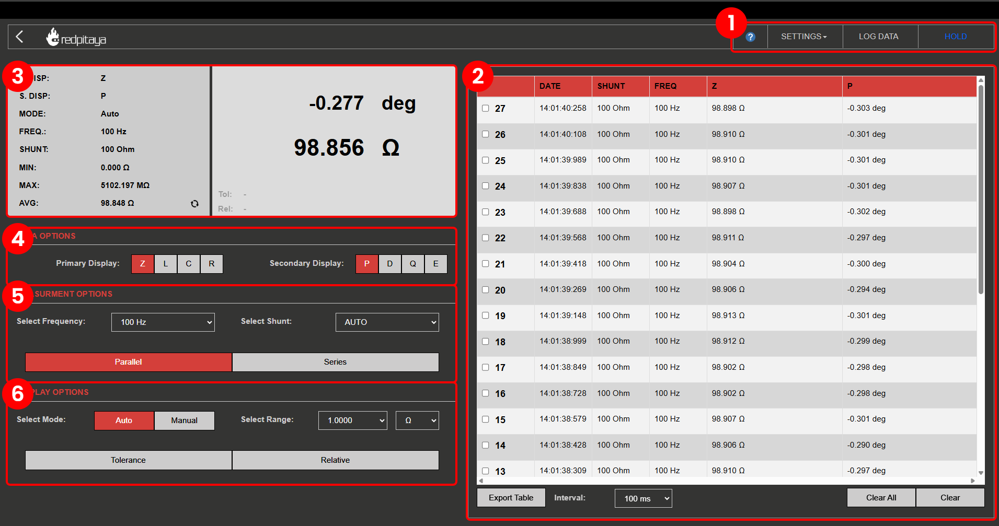

.. _lrc_app:

############
LCR meter
############

.. figure::  img/01_iPad_Combo_LCR.jpg
	:width: 1600

This application will turn your Red Pitaya into an affordable LCR meter. It is the perfect tool for professionals, educators, students, makers, and hobbyists seeking affordable, highly functional test and measurement equipment.
Resistors, capacitors, and inductors are basic components of all electrical circuits, and while working on your projects, you will need to measure some components lying around on your working bench. The Red Pitaya's LCR meter will enable you to speed up the procedure and accurately measure the components just by switching from one application to another.

.. note:: 

    An additional extension module is needed to use the LCR meter application. The module can be purchased from the `Red Pitaya store <https://redpitaya.com/shop/>`_.

All Red Pitaya applications are web-based and don't require the installation of any native software. Users can access them via a browser using their smartphone, tablet or a PC running any popular operating system (MAC, Linux, Windows, Android, and iOS).
The elements of the LCR meter application are arranged logically and offer a familiar user interface similar to bench LCR meters.

The graphical interface is divided into 6 main areas:

#. **Top settings menu** - Provides overall control of the application. Reset application settings, log data and start/stop measurements.
#. **Logging table** - Displays logged measurement data and provides options to export or clear the data.
#. **Main and secondary display** - Displays the primary and secondary measured parameters as well as the current settings of the application.
#. **Data options** - Select the primary and secondary parameters to be measured and displayed on the main and secondary display.
#. **Measurement options** - Select the measuring frequency, shunt value and equivalent circuit.
#. **Display options** - Select measurement mode, range mode, and enable tolerance and relative measurements.

|

Features
*********

.. contents:: Table of Contents
    :local:
    :depth: 2
    :backlinks: top

|

1. Compatibility
=================

The LCR meter application is compatible with the following Red Pitaya models:

**Gen 2 boards:**

* STEMlab 125-14 PRO Z7020 Gen 2
* STEMlab 125-14 PRO Gen 2
* STEMlab 125-14 Gen 2

**Original boards:**

* STEMlab 125-14 (LN, ext. clk, Z7020, etc.)
* SIGNALlab 250-12
* STEMlab 125-10

|

2. Connecting the LCR module
==============================

.. figure::  img/E_module_connection.png
    :width: 1000

3. Top settings menu
=======================

The top settings menu provides overall control of the application. The blue question mark leads to this exact documentation page.

Settings
---------

The settings menu provides control over the application settings:

* **Reset** - Resets the application settings to default values.

Log data
---------

The log data button starts and stops the logging of measurement data. When logging is started, the button will turn red and the logged data will be displayed in the 
`logging table <4. Logging table>`_. The user can export or clear the logged data.

Hold button
------------

The hold button freezes the current measurement values on the main and secondary display. When the hold button is pressed, the button will turn red and the 
current values will be frozen. Pressing the button again will unfreeze the values.

|

4. Logging table
====================

The logging table displays the logged measurement data. Each entry in the table contains the following information:

* **No.** - The entry number.
* **Data and time** - The date and time when the measurement was logged.
* **Shunt** - The shunt value used for the measurement.
* **Frequency** - The frequency used for the measurement.
* **Primary parameter** - The measured primary parameter value. Depending on the selected primary parameter, the value can be in Ohms, Farads, or Henrys.
* **Secondary parameter** - The measured secondary parameter value. Depending on the selected secondary parameter, the value can be in degrees or unitless.

Each entry in the table can be selected by clicking on it. The selected entries can be cleared from the table by pressing the "Clear" button in the logging table options.

The data table is empty upon application start. The user can start logging data by pressing the "Log data" button in the top settings menu.
The table can hold a maximum of 1000 entries. When the limit is reached, the oldest entry will be removed to make room for the new one.

It provides the following options:

* **Export table** - Exports the logged data to a CSV file.
* **Interval** - Select the logging interval. The user can select from 100 ms, 500 ms, 1 s, 1.5 s, 2.0 s, 2.5 s, and 3.0 s.
* **Clear All** - Clears the logged data from the table.
* **Clear** - Clears the selected data rows from the table.

|

5. Main and secondary display
================================

The main and secondary display show the measured primary and secondary parameters as well as the current settings of the application.

The main display on the left shows the following information:

* **Primary parameter** - The measured primary parameter value. Located in the middle of the screen.
* **Secondary parameter** - The measured secondary parameter value. Located directly above the primary parameter.2
* **Tolerance and relative values** - The tolerance and relative values are displayed in the bottom left corner of the primary display. These values are greyed out
  until the tolerance or relative mode is enabled.

The secondary display on the right shows the following information:

* **Primary display (P. DISP)** - Displays the unit symbol of the primary parameter.
* **Secondary display (S. DISP)** - Displays the unit symbol of the secondary parameter.
* **Mode** - Displays the current shunt selection mode (Auto or Manual).
* **Frequency** - Displays the currently selected measuring frequency.
* **Shunt** - Displays the currently selected shunt value.
* **Min/Max/Average** - Displays the minimum, maximum, and average values of the measured primary parameter. The values are calculated from the last 
  100 measurements. The user can reset these values by rotating the arrow In the bottom right corner of the secondary display.

|

6. Data options
================

The data options menu provides control over the primary and secondary parameters to be measured and displayed on the main and secondary display.

Measured primary parameters
-----------------------------

The LCR meter application will enable you to measure the basic parameters of the passive electrical components:

    * **R** - resistance.
    * **C** - capacitance.
    * **L** - inductance.
    * **Z** - impedance.

Measured secondary parameters
-------------------------------

Alongside the main parameters, the secondary parameters are also measured and calculated. These parameters are common in describing the properties 
and the quality of the passive components:

    * **P** - impedance phase (phase between measured current and voltage).
    * **D** - dissipation factor (often used to quantify capacitor quality).
    * **Q** - quality factor (often used to quantify inductor quality).
    * **ESR** - equivalent series resistance.

|

7. Measurement options
=======================

The measurement options menu provides control over the measuring frequency, shunt value, and equivalent circuit.

Select frequency
-------------------------

The LCR meter enables measurements at the following frequencies:

* 10 Hz
* 100 Hz
* 1 kHz
* 10 kHz
* 100 kHz
* 1 MHz

The user can select a desired frequency, and the LCR application will use sine signals with the selected frequency to measure the impedance.

Select shunt
---------------

The LCR meter application uses a shunt resistor to measure the current flowing through the device under test (DUT). The shunt resistor is connected in series 
with the DUT, and the voltage drop across the shunt is measured to calculate the current. The user can select from a range of shunt resistors, which are used 
to measure different ranges of impedance.

The available shunt resistors are:

* **Auto** - The LCR meter will automatically select the appropriate shunt resistor based on the measured impedance.
* **10 Ω**
* **100 Ω**
* **1 kΩ**
* **10 kΩ**
* **100 kΩ**
* **1 MΩ**

The automatic shunt selection is only possible with the LCR meter extension module. 

Equivalent circuit calculation mode
------------------------------------

The Parallel and Series measuring modes denote the use of a series or parallel equivalent circuit to calculate the parameters (R, C, L...) 
from the measured impedance Z. The LCR meter will only measure the complex value *Z=|Z|e(jP)*, where P is the measured phase and *|Z|* is 
the impedance amplitude. All other parameters are calculated from the series or parallel equivalent circuit.

|

8. Display options
=====================

The display options menu provides control over the measurement mode, range mode, and enables tolerance and relative measurements.

Select mode
------------

Range mode determines how the LCR meter will select the measuring range. The LCR meter can automatically select the best measuring range based on the 
measured values, or the user can manually select a range.

* **Auto** - The LCR meter will automatically select the best measuring range based on the measured values.
* **Manual** - The user can manually select a measuring range in the **Select range** menu.

Select range
-------------

The user can select a measuring range in the **Select range** menu. This determines the decimal point position of the measured values as 
well as the unit of the measured values. The available ranges are:

Decimal point position:

* **1.0000**
* **10.000**
* **100.00**
* **1000.0**

Unit of measured values:

* **nΩ**
* **μΩ**
* **mΩ**
* **Ω**
* **kΩ**
* **MΩ**

Measurement mode
------------------

The tolerance and relative buttons enable the corresponding measurement mode. Selecting either enables the corresponding value on the primary display.

    * **Tolerance mode** - The last value measured before clicking the "Tolerance" button is saved and used to calculate the percentage difference between the new value and the saved one.
    * **Relative mode** - The last value measured before clicking the "Relative" button is saved and used to calculate the relative difference between the new value and the saved one.

|

Specifications
*****************

.. ! CHECK THE SIGNALLAB basic accuracy.

+-------------------------------+----------------------------+---------------------------------+---------------------------------+
|                               | | **STEMlab 125-14**       | **SIGNALlab 250-12**            | **STEMlab 125-10**              |
|                               | | **STEMlab 125-14 Gen 2** |                                 |                                 |
|                               | | [#f1]_                   |                                 |                                 |
|                               | |                          |                                 |                                 |
+===============================+============================+=================================+=================================+
| Measured primary parameters   | Z, L, C, R                 | Z, L, C, R                      | Z, L, C, R                      |
+-------------------------------+----------------------------+---------------------------------+---------------------------------+
| Measured secondary parameters | P, D, Q, E                 | P, D, Q, E                      | P, D, Q, E                      |
+-------------------------------+----------------------------+---------------------------------+---------------------------------+
| Selectable frequencies        | | 10 Hz                    | | 10 Hz                         | | 10 Hz                         |
|                               | | 100 Hz                   | | 100 Hz                        | | 100 Hz                        |
|                               | | 1 kHz                    | | 1 kHz                         | | 1 kHz                         |
|                               | | 10 kHz                   | | 10 kHz                        | | 10 kHz                        |
|                               | | 100 kHz                  | | 100 kHz                       | | 100 kHz                       |
|                               | | 1 MHz                    | | 1 MHz                         | | 1 MHz                         |
+-------------------------------+----------------------------+---------------------------------+---------------------------------+
| Impedance range               | 1 Ω - 10 MΩ                | 1 Ω - 10 MΩ                     | 1 Ω - 10 MΩ                     |
+-------------------------------+----------------------------+---------------------------------+---------------------------------+
| DC bias                       | 0.5 V                      | 0.5 V                           | 0.5 V                           |
+-------------------------------+----------------------------+---------------------------------+---------------------------------+
| Basic accuracy                | 1.00 %                     | 2.00 %                          | 5.00 %                          |
+-------------------------------+----------------------------+---------------------------------+---------------------------------+
| Max input voltage             | 0.5 Vpp                    | 0.5 Vpp                         | 0.5 Vpp                         |
+-------------------------------+----------------------------+---------------------------------+---------------------------------+
| Input protection              | Yes                        | Yes                             | Yes                             |
+-------------------------------+----------------------------+---------------------------------+---------------------------------+
| Parameter range Z             | 1 Ω - 10 MΩ                | 1 Ω - 10 MΩ                     | 1 Ω - 10 MΩ                     |
+-------------------------------+----------------------------+---------------------------------+---------------------------------+
| Parameter range Rs, Rp        | 1 Ω - 10 MΩ                | 1 Ω - 10 MΩ                     | 1 Ω - 10 MΩ                     |
+-------------------------------+----------------------------+---------------------------------+---------------------------------+
| Parameter range Ls, Lp        | 100 nH - 1000 H            | 100 nH - 1000 H                 | 100 nH - 1000 H                 |
+-------------------------------+----------------------------+---------------------------------+---------------------------------+
| Parameter range Cs, Cp        | 1 pF - 100 mF              | 10 pF - 100 mF                  | 10 pF - 100 mF                  |
+-------------------------------+----------------------------+---------------------------------+---------------------------------+
| Parameter range P             | ±180 deg                   | ±180 deg                        | ±180 deg                        |
+-------------------------------+----------------------------+---------------------------------+---------------------------------+

**Footnotes:**

.. [#f1] The specifications are valid for all Red Pitaya Gen 2 boards and variations of original generation STEMlab 125-14 (external clock, Low-noise, etc.)

|

Source code
************

The `LCR Meter source code <https://github.com/RedPitaya/RedPitaya/tree/master/apps-tools/lcr_meter>`_ is available on our GitHub.

.. substitutions

