.. _la_app:

Logic Analyzer
##############

.. figure:: img/01_LA_ipad.jpg
	:width: 1600

The Logic Analyzer is used for analyzing digital signals. From binary signals, such as GPIO outputs of the Raspberry Pi or Arduino board, to analyzing different buses (I2C, SPI, UART and CAN) and 
decoding the transmitted data. The application is web-based and doesn't require the installation of any native software. Users can access them via any web browser (Google Chrome is recommended) 
using their smartphone, tablet or a PC running any popular operating system (MAC, Linux, Windows, Android, and iOS).

Out-of-the-box it can be used to analyze digital signals up to 3.3 V. For higher voltage levels, an extension module is available that extends the voltage range to 5 V and provides protection 
for the GPIO pins. The Logic Analyzer application is available on all Red Pitaya models.

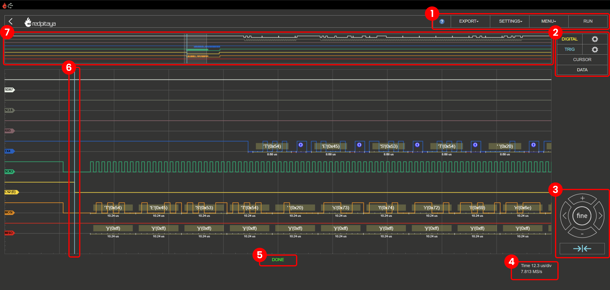

The user interface consists of the following elements:

    1. **Top settings menu** - Includes basic functions for exporting data, saving settings, changing general application settings, and running or stopping measurements.
    #. **Digital and trigger settings** - This menu allows you to configure the digital inputs, trigger settings, add cursors, and set up the bus decoding.
    #. **Axis control panel** - Pressing the vertical ± buttons changes the scale of the time axis (X axis). The horizontal <> buttons are used to move along the time axis (left and right).
    #. **Scale info** - Displays the current time frame per division and sampling rate.
    #. **Status display** - Displays information about the current recording status (done, waiting, ready).
    #. **Trigger indicator** - The vertical blue trigger indicator displays the trigger event on the time axis. The trigger event is always located at the zero point of the time axis.
    #. **Minimap** - The minimap shows the entire recorded signal and allows you to quickly navigate through the recorded data.

|

Features
*********

.. contents:: Table of Contents
   :local:
   :depth: 2
   :backlinks: top

|

1. Top settings menu
=====================

Provides control over the Logic analyzer application. The blue question mark leads to this exact documentation page.

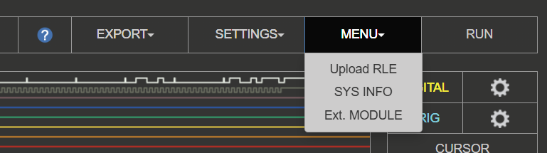

Export
------

Exports the currently displayed data in one of the following formats:

    - **Graph** - Takes a screenshot of the application and automatically downloads it via the browser.
    - **RLE** - Run-Length Encoding (RLE) is a simple form of data compression in which runs of data are stored as a single data value and count. The RLE format is used for storing 
      the recorded data in a compressed format that can be later decoded or imported back into the Logic Analyzer application.
    - **Lines** - Exports the data in a CSV format, with the ability to normalize the data and export the view.
    - **File** - Exports the data in either WAV, CSV, or TDMS format, with the ability to normalize the data and export the view.

Settings
----------

The settings menu provides control over the application settings:

    - **Save** - Saves the current Logic Analyzer settings under the specified name. The settings are saved in the SD card's local storage (board model specific).
    - **Reset** - Resets all Logic Analyzer settings to default versions.
    - **Recall** (user-specified name) - Recalls the previously saved Logic Analyzer settings. Each saved setting is listed in the drop-down menu, and the user can select the desired one.

Menu
---------

    * **Upload RLE** - Uploads a previously saved RLE file and displays the data in the Logic Analyzer application. The bus decoding settings must be set for the uploaded data to be decoded correctly.
    * **Sys info** - Displays information on Red Pitaya board (FPS, data throughput, CPU load, memory usage).
    * **Ext. Module** - Check if the LA extension module is connected (inverts the logic levels).

Run/Stop
---------

Starts or stops the data acquisition/Logic analyzer.

|

2. Digital signal settings
===========================

The Logic Analyzer application can capture up to 8 different digital signals. The signals are displayed as binary values (0 or 1). The digital settings are accessible by clicking the gear icon 2
next to the "DIGITAL" selection field.

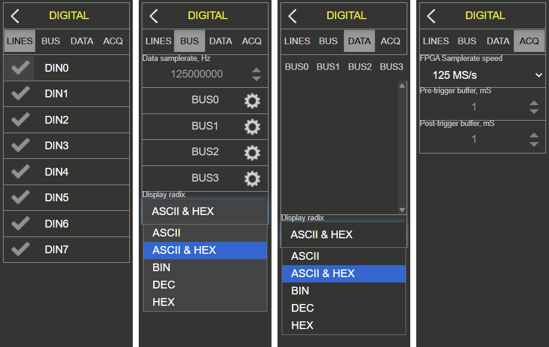

The digital settings are split into four sections:

    * **Lines** - Enable or disable the individual digital channels.
    * **Bus** - Assign digital channels to a particular bus and configure the bus decoding settings.
    * **Data** - Display the decoded data of one or more busses in a table format.
    * **Acq** - Set the sample rate and pre-/post-sample data buffer.

As long as no bus systems have been configured, the channels operate as purely digital inputs and correspondingly show progress. The **ACQ** tab opens the selection field for the sample rate settings. 

.. note::

    The sample rate (in the **Acq** tab) should be set to at least twice the baudrate of the measured digital signal.

.. note::

    The sample rate has a significant influence on the time section, which can be represented. The memory depth of the Logic Analyzer application is 1 MS, so it can store and display 1,000,000 
    binary values. From this, it is clear that the sampling rate determines how many values are recorded per second. If we chose the highest sampling rate (125 MS/s), 125,000,000 values would 
    be recorded per second. Since 1,000,000 values can be stored in the time memory, we get a 0.008-second time window. With a sampling rate of 1 MS/s, the time window of the recorded signal 
    will be one full second.

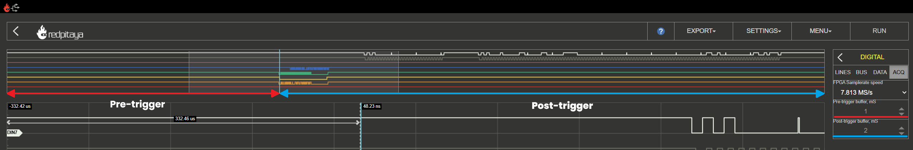

When the pre-sample data buffer value is set, the trigger event of the recording is located. This makes particular sense if you want to find out what happened before the defined trigger event. 
To illustrate with an example, the sample rate is set to 4 MS/s. The stored time segment thus amounts to approximately 0.25 s = 250 ms. If the pre-sample data buffer is set to 10 ms, then 
the recorded signal shows what has happened 10 ms before the event and 240 ms after the event.

Lines
-----

The channels can be activated or deactivated by simply clicking the check mark. Each line can be assigned a name, which is displayed in the corresponding line cursor.  To change the name, click 
on the channel name and enter the desired name (4 characters maximum).

Bus encoder settings
--------------------

Bus encoder settings define the protocol used to decode the digital signals. Data samplerate settings should be set to the exact sample rate value that was used to record the data:

- **Data capture** - When data is captured, the ``Data samplerate`` is automatically set to the sample rate of the recorded data.
- **Upload RLE** - When an RLE file is uploaded, the ``Data samplerate`` must be manually set to the sample rate at which the data was recorded.

The Logic Analyzer can decode up to four different bus protocols at the same time. To decode data:

1. **Set data samplerate** - Set the data samplerate to the sample rate at which the data was recorded.
2. **Select bus** - Select the bus to be decoded (Bus 0 - 3).
3. **Select bus protocol** - Select the desired bus protocol (I2C, SPI, UART, CAN).
4. **Configure bus settings** - Configure the bus settings (e.g., baud rate, data bits, etc.).
5. **Set display radix** - Set the display radix of the decoded data (ASCII, ASCII & HEX, DEC, BIN, HEX).

.. note::

    The full example of setting up the Logic Analyzer is shown in the `How to decode bus data?`_ chapter.

Bus encoder options
--------------------

The following bus protocols are supported by the Logic Analyzer application:

**UART**

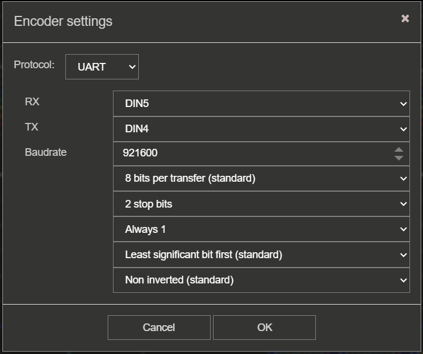

The following settings can be adjusted:

    * **Data lines** - Select the digital channels that represent the RX and TX signals.
    * **Baudrate** - Set the baud rate of the UART signal.
    * **Data bits** - Set the number of data bits in the UART signal (5, 6, 7, 8, 9).
    * **Stop bits** - Set the number of stop bits in the UART signal (0, 0.5, 1, 1.5, 2).
    * **Parity** - Set the parity of the UART signal (None, Even, Odd, Mark/Always 1, Space/Always 0).
    * **Bit order** - Set the bit order of the UART signal (LSB first, MSB first).
    * **Polarity** - Set the polarity of the UART signal (Normal, Inverted).

**SPI**

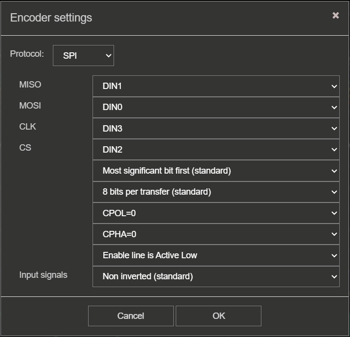

The following settings can be adjusted:

    * **Data lines** - Select the digital channels that represent the MOSI, MISO, SCK, and CS signals.
    * **Bit order** - Set the bit order of the SPI signal (LSB first, MSB first).
    * **Data bits** - Set the number of data bits in the SPI signal (7, 8, 9).
    * **Clock polarity** - Set the clock polarity of the SPI signal (Low/0, High/1).
    * **Clock phase** - Set the clock phase of the SPI signal (Leading/0, Trailing/1).
    * **Enable** - Set the enable signal of the SPI signal (Low/0, High/1).
    * **Polarity** - Set the polarity of the SPI signals (Normal, Inverted).

**I2C**

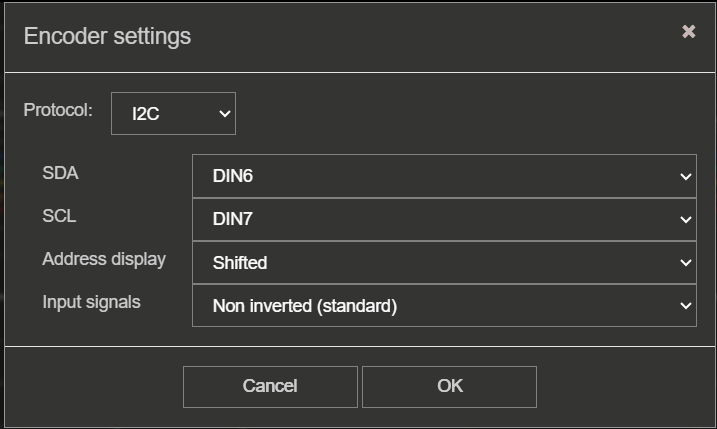

The following settings can be adjusted:

    * **Data lines** - Select the digital channels that represent the SDA and SCL signals.
    * **Address display** - Set the address display of the I2C signal (Shifted, Unshifted).
    * **Polarity** - Set the polarity of the I2C signals (Normal, Inverted).

**CAN**

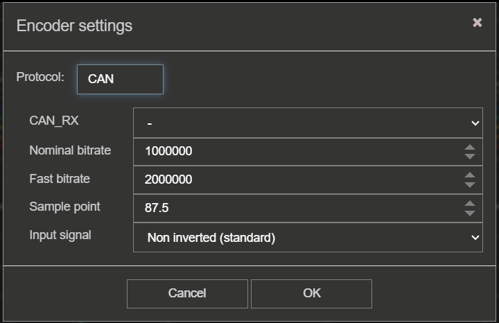

The following settings can be adjusted:

    * **Data lines** - Select the digital channels that represents the CAN_RX signal.
    * **Nominal bit rate** - Set the nominal bit rate of the CAN signal.
    * **Fast bit rate** - Set the fast bit rate of the CAN signal.
    * **Sample point** - Set the sample point of the CAN signal.
    * **Polarity** - Set the polarity of the CAN signals (Normal, Inverted).
    * **Max detected frames** - Set the maximum number of detected frames.

Data
----

The Data tab allows you to display the decoded data of one or more busses in a table format. The data can be displayed in ASCII, ASCII & HEX, DEC, BIN, or HEX format.

.. !

For more information on the data, please refer to the `5. Decoded data table`_ section of the documentation.

Acquisition
-----------

The acquisition tab allows you to set the sample rate and pre-/post-sample data buffer. The sample rate should be set to at least twice the baudrate of the measured digital signal. 
The pre-sample data buffer value is used to determine how much data is recorded before the trigger event.

|

3. Trigger settings
====================

The trigger settings are accessible by clicking the gear icon next to the "TRIG" selection field.

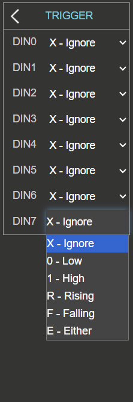

The trigger settings allow you to define the conditions under which data acquisition starts. Each digital channel can be set as a trigger source with specific criteria. The following 
trigger types are available:

    * **X - Ignore** - No event.
    * **0 - Low** - Low level.
    * **1 - High** - High level.
    * **R - Rising** - Rising edge.
    * **F - Falling** - Falling edge.
    * **E - Either** - Edge change (rising or falling edge).

The trigger condition is met when all digital channel trigger sources are in the desired state (only **AND mode** is available currently).

For automatic acquisition, at least one of the trigger sources must be set to a rising or falling edge. The other trigger sources can be set to any of the available trigger types.

By clicking the **RUN** button, the recording is started. The status display informs you whether the process is still running (**WAITING**) or has already been completed (**DONE**). 
After finishing the acquisition, the results are displayed in a graph. Additional trigger options, LOW and HIGH, are used for the so-called pattern triggering. For example, if you 
set the trigger source to be DIN0 - Rising edge (to have one channel defined as a trigger source with a rising or falling edge is a mandatory condition for the acquisition to start), 
DIN1 to HIGH and DIN2 to LOW, this will cause such behaviour that the application logic will wait for the state where DIN0 goes from 0 to 1, DIN1 is 1, and DIN2 is 0 to start the acquisition.

|

4. Cursors
============

As with the Oscilloscope, the Logic Analyzer also provides cursors for quick measurements. Because there are no variable amplitude readings but only discrete signal levels, the cursors are 
available exclusively for the time axis. When enabled, the cursors will show the relative time to zero point (trigger event) and the difference between the two.

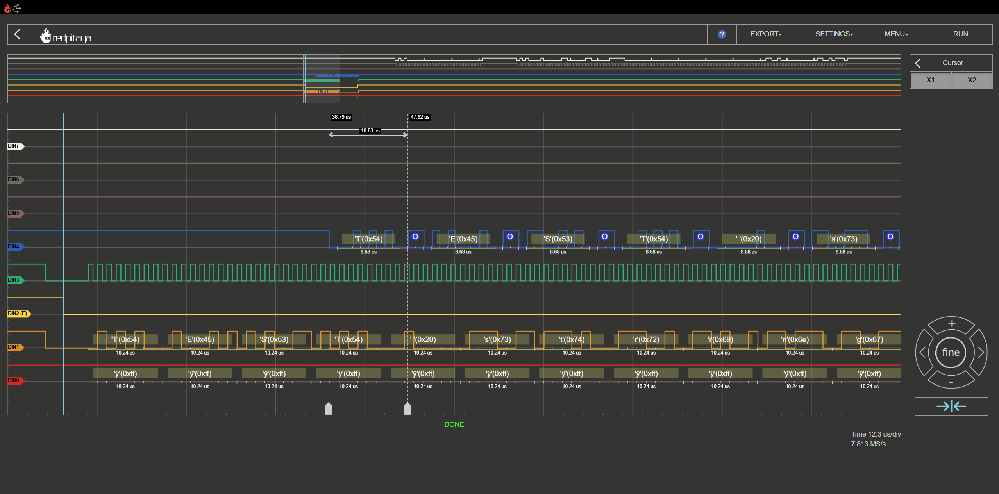

|

5. Decoded data table
======================

.. figure:: img/LA_data.png
    :width: 1000

The data table displays the decoded data of one or more busses in a table format. The data is searchable and includes the following columns:

    * **Time offset** - The time offset of the decoded data from the trigger event (zero point).
    * **Time** - Duration of the event.
    * **Line** - The digital channel that the decoded data belongs to.
    * **Info** - Information on the type of packet (e.g., Start bit, Data, Stop bit, etc.).
    * **Data** - The decoded data in the selected format (ASCII, ASCII & HEX, DEC, BIN, HEX).
    * **Samples start** - The sample number at which the decoded data starts.
    * **Samples count** - The number of samples that the decoded data occupies.

The decoded data table can be filtered by typing a search term in the search field. The table will only display rows that contain the search term in any of the columns.

.. note::

    For the bus data to show up in the data table, the bus must be selected (highlighted) under the **DATA** tab in the **DIGITAL** settings menu. The bus must also be configured and 
    the data must be decoded.

Clicking on a row in the data table will align the time axis to the start of the selected data (aligned with the middle of the graph) - see the position of the cursors in the image below.

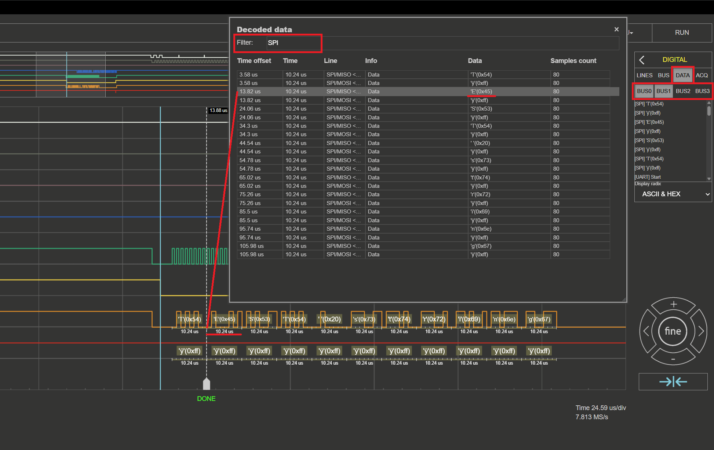

|

6. Axis control panel
=======================

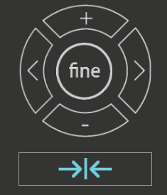

The axis control panel allows you to change the scale of the time axis (X-axis) and move along the time axis (left and right). The vertical ± buttons change the scale of the time axis, 
while the horizontal <> buttons are used to move along the time axis (left and right). When the fine button is selected, the time axis can be moved in smaller steps. The current time 
frame per division and sampling rate are displayed in the **scale info section**.

Clicking the blue trigger indicator below the axis control pannel will center the time axis on the trigger event. The trigger event is always located at the zero point of the time axis.

|

7. Trigger position indicator
==============================

The trigger position indicator is a vertical blue line that shows the position of the trigger event on the time axis. The trigger event is always located at the zero point of the time axis.

By double-clicking anywhere on the graph, the time axis will recenter on the trigger event, and the trigger position indicator will be aligned with the zero point of the time axis.

|

8. Minimap
===========

The minimap shows the entire recorded signal and allows you to quickly navigate through the recorded data. The minimap is located at the top of the graph and displays a smaller version of the 
recorded signal. The current view is highlighted in white, with a blue line representing the triggering moment. You can click and drag the white area to move along the time axis or click on
an area of the minimap to jump to that position in the recorded signal. The minimap is especially useful when working with long recordings, as it allows you to quickly navigate through 
the data without having to scroll through the entire graph.

|

Hardware/Connections
***********************

The Logic Analyser extension module is recommended for maximum performance of the Logic Analyzer application and protection of your Red Pitaya board. Using the LA extension module is straightforward; 
plug it into your Red Pitaya and connect the leads to the desired measurement points.

.. figure:: img/12_LA_probes.png
	:width: 1000

To use the Logic Analyzer without the extension module, you need to be more careful in connecting the logic analyser probes to the :ref:`E1 <E1_orig_gen>` on the Red Pitaya board 
(**3V3 logic ONLY**). The pins used for the logic analyser board are shown in the picture below.

The direct use of the GPIO :ref:`E1 <E1_orig_gen>` pins of the Red Pitaya board works on any Red Pitaya model. A connection example is shown in the image below (left).
    
.. figure:: img/13_LA_connect.png
	:width: 1000

|

Specifications
****************

.. table::
    :widths: 30 40 40

    +-------------------------+--------------------------+--------------------------+
    |                         | **Direct E1 connection** | **LA extension module**  |
    +=========================+==========================+==========================+
    | Channels                | 8                        | 8                        |
    +-------------------------+--------------------------+--------------------------+
    | Sampling rate (max.)    | 125 MS/s                 | 125 MS/s                 |
    +-------------------------+--------------------------+--------------------------+
    | Maximum input frequency | 50 MHz                   | 50 MHz                   |
    +-------------------------+--------------------------+--------------------------+
    | Supported bus protocols | I2C, SPI, UART, CAN      | I2C, SPI, UART, CAN      |
    +-------------------------+--------------------------+--------------------------+
    | Input voltage           | 3.3 V                    | 2.5 ... 5.5 V            |
    +-------------------------+--------------------------+--------------------------+
    | Overvoltage protection  | N/A                      | Integrated               |
    +-------------------------+--------------------------+--------------------------+
    | Level thresholds        | | 0.8V (low)             | | 0.8V (low)             |
    |                         | | 2.0V (high)            | | 2.0V (high)            |
    +-------------------------+--------------------------+--------------------------+
    | Input impedance         | 100 kΩ, 3 pF             | 100 kΩ, 3 pF             |
    +-------------------------+--------------------------+--------------------------+
    | Trigger types           | Level, edge, pattern     | Level, edge, pattern     |
    +-------------------------+--------------------------+--------------------------+
    | Memory depth            | 1 MS (typical)           | 1 MS (typical)           |
    +-------------------------+--------------------------+--------------------------+
    | Sampling interval       | 8 ns                     | 8 ns                     |
    +-------------------------+--------------------------+--------------------------+
    | Minimum pulse duration  | 10 ns                    | 10 ns                    |
    +-------------------------+--------------------------+--------------------------+

How to decode bus data?
************************

Here is a quick tutorial on how to decode bus data using the Logic Analyzer application.

1. **Extension module** - If the LA extension module to the Red Pitaya board, check the **Ext. Module** box in the settings menu. This will invert the logic levels and protect the GPIO pins.
#. **Connect the probes** - Connect the probes to the desired measurement points.
#. **Select the digital channels** - In the **DIGITAL** menu, select the desired digital channels. Up to 8 channels can be selected.
#. **Configure the bus** - In the **BUS** menu, select the desired bus protocol (I2C, SPI, UART, CAN). Configure the bus settings (e.g., baud rate, data bits, etc.).
#. **Set trigger** - In the **TRIGGER** menu, configure the trigger condition.
#. **Start the measurement** - Click the **RUN** button to start the data acquisition. The status display will show **WAITING** until the trigger condition is met, and then **DONE** once the acquisition is complete.

.. figure:: img/LA_recording.png
	:width: 1200

The captured data is detected automatically and decoded according to the selected format.
The decoded data is placed as a separate layer in the graph directly on the signal and is available in table format in the **DIGITAL DATA** menu.

|

Source code
************

The :rp-github:`Logic Analyzer source code <RedPitaya/tree/master/apps-tools/la_pro>` is available on our GitHub.
