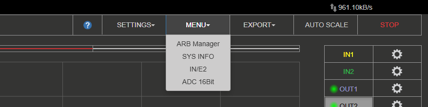

.. _osc_app:

Oscilloscope & Signal Generator
###############################

.. figure:: img/Slika_01_iPad_Combo_Oscilloscope.jpg
    :width: 1600

This application will turn your Red Pitaya board into a 2-channel oscilloscope and a 2-channel signal generator. It is the perfect tool for educators, students, makers, hobbyists, and professionals seeking affordable, 
highly functional test and measurement equipment. The simple and intuitive user interface provides all the necessary tools for signal analysis and measurements.

High-end specifications will satisfy more demanding users looking for powerful tools for their workbenches. The application is web-based and doesn’t require the installation of any native software. Users can access 
them via any web browser (Google Chrome is recommended) using their smartphone, tablet or a PC running any popular operating system (MAC, Linux, Windows, Android, and iOS). The elements in the Oscilloscope & Sig. 
Generator applications are arranged logically and offer a familiar user interface.

.. tabs::

   .. tab:: 2-channel devices

        .. figure:: img/Slika_02_OSC.png
            :width: 1000
            :align: center

   .. tab:: 4-channel devices

        .. note::

            Due to lack of outputs STEMlab 125-14 4-Input does not feature a signal generator.

        .. figure:: img/Slika_02_OSC_4-in.png
            :width: 1000
            :align: center

Apart from the graph, the user interface consists of six areas:

    1. **Top settings menu** - Includes basic functionality like Settings, Exporting data, Autoscale and Running/Stopping the measurements.
    #. **Channel and trigger settings** - This menu provides control over inputs and outputs, triggers, guides, and measurements.
    #. **Axis control panel** - By pressing the horizontal ± buttons, the time axis (X axis) scale is changed. The vertical ± buttons change the amplitude axis (Y axis) and thus the displayed voltage range of the signal.
    #. **Time and trigger info** - Displays the current time scale per division, trigger settings (time frame, trigger, zero point of the X-axis) and sampling rate.
    #. **Channel amplitude scale** - Indicates the Y axis scale for all displayed channels.
    #. **Measurements display** - Displays the results of performed measurements.

|
    
Features
********

The Oscilloscope & Signal generator's main features are listed below:

    -   Run/stop and auto-set functionality
    -   Signal position and scale control
    -   Trigger control (source, level, slope)
    -   Trigger modes: auto, normal, and single triggering
    -   Cursors
    -   Measurements
    -   Mathematical operations
    -   Signal generator control (waveform, amplitude, frequency, phase)
    -   Custom waveform output (Arbitrary waveform generator)
    -   Control over slow analog inputs and outputs

.. contents:: Table of contents
    :local:
    :backlinks: top

|

1. Top settings menu
=====================

Provides control over the Oscilloscope application. The blue question mark leads to this exact documentation page.

Settings
----------

The settings menu provides control over the application settings:

- **Save** - Saves the current Oscilloscope and Signal Generator settings under the specified name. The settings are saved in the SD card's local storage (board model specific).
- **Reset** - Resets all Oscilloscope and Signal Generator settings to default versions.
- **Recall** (user-specified name) - Recalls the previously saved Oscilloscope and Signal Generator settings. Each saved setting is listed in the drop-down menu, and the user can select the desired one.

Menu
-----

Includes the following settings:

- **ARB Manager** - Goes directly to the :ref:`Arbitrary Waveform Manager application <arb_manager_app>`, where a custom waveform can be uploaded for generation.
- **Sys Info** - When checked, the Oscilloscope Application displays System information like, FPS, CPU Load, etc. in the bottom left corner of the application.
- **IN/E2** - When checked, displays the voltages from slow analog inputs of the E2 connector.
- **ADC 16 bit** - When checked, the oscilloscope will display the data in 16-bit resolution, provided that the decimation factor is sufficiently high (available on boards with non-16-bit native resolution).
- **Ext. Clock** (only SIGNALlab 250-12) - Enables the External Clock synchronisation for the SIGNALlab. For more info see the chapter below.

External reference clock (only SIGNALlab 250-12)
-------------------------------------------------

The external reference clock input can be enabled through the settings menu. Once enabled, its status is displayed in the main interface. The "green" status indicates that the sampling clock is locked to the external reference clock.

.. figure:: img/osc_top_menu_ext_clk.png
    :width: 600

Export
---------

Exports the currently displayed data as either a "Graph" or a "File". If graph is chosen, a screenshot of the application is taken and automatically downloads via the browser. Otherwise, the data is exported in either WAV, CSV, or TDMS format, with the ability to normalize the data and export the view.

.. figure:: img/Slika_14_OSC_Export_data.png
    :width: 600

Autoscale
----------

Automatically sets up the Oscilloscope to best display the input signal. By pressing this button, the voltage axis and the time axis are set so that at least one full period of the signal fills the screen.

    .. figure:: img/Slika_03_OSC_left.png
        :width: 1000
        :align: center

    .. figure:: img/Slika_03_OSC_right.png
        :width: 1000
        :align: center

Run/Stop
-----------

Starts/Stops the data acquisition/Oscilloscope. When stopped, the application ignores any trigger conditions.

|

2. Inputs
==========
  
On the right side of the Oscilloscope & Sig. Generator application interface, the IN1 and IN2 channels are listed. With a simple click on the name of a channel (not the gear), the channel gets highlighted, and you can simply 
control all the settings of the respective channel. The available settings by device model:

.. tabs::

    .. tab:: STEMlab 125-14, 125-10, 4-Input

        .. figure:: img/osc_inputs_standard.png
            :height: 400

        -   **Show** - Shows or hides the curve associated with the channel.
        -   **Invert** - Reflects the graph on the X-axis.
        -   **Name** - Allows the user to rename the channel (4 characters max).
        -   **Probe attenuation** - (must be selected manually) The division of the probe.
        -   **Center offset** - Offset of the curve along the Y-axis (channel cursor). The offset is applied in the web interface only and does not affect the actual signal.
        -   **Zero reference** - Vertically offsets the curve relative to the channel cursor. Helps zooming in on a specific part of the signal. The offset is applied in the web interface only and does not affect the actual signal.
        -   **Input attenuation (LV and HV)** - Input attenuation of the board. Must be selected according to the :ref:`jumper position <anain>` on each channel.
        -   **Filter (On/Off)** - Enables or disables the frequency equalisation filter on the input channel. The filter is disabled on Gen 2 boards.
        -   **Interpolation** - See `Interpolation`_ below.
        -   **Trace Mode** - See `Trace Mode`_ below.

    .. tab:: SDRlab 122-16

        .. figure:: img/osc_inputs_sdrlab.png
            :height: 400

        -   **Show** - Shows or hides the curve associated with the channel.
        -   **Invert** - Reflects the graph on the X-axis.
        -   **Name** - Allows the user to rename the channel (4 characters max).
        -   **Probe attenuation** - (must be selected manually) The division of the probe.
        -   **Center offset** - Offset of the curve along the Y-axis (channel cursor). The offset is applied in the web interface only and does not affect the actual signal.
        -   **Zero reference** - Vertically offsets the curve relative to the channel cursor. Helps zooming in on a specific part of the signal. The offset is applied in the web interface only and does not affect the actual signal.
        -   **Interpolation** - See `Interpolation`_ below.
        -   **Trace Mode** - See `Trace Mode`_ below.

    .. tab:: SIGNALlab 250-12

        .. figure:: img/osc_inputs_signallab.png
            :height: 400

        -   **Show** - Shows or hides the curve associated with the channel.
        -   **Invert** - Reflects the graph on the X-axis.
        -   **Name** - Allows the user to rename the channel (4 characters max).
        -   **Probe attenuation** - (must be selected manually) The division of the probe.
        -   **Center offset** - Offset of the curve along the Y-axis (channel cursor). The offset is applied in the web interface only and does not affect the actual signal.
        -   **Zero reference** - Vertically offsets the curve relative to the channel cursor. Helps zooming in on a specific part of the signal. The offset is applied in the web interface only and does not affect the actual signal.
        -   **Input attenuation** - 1:1 (± 1V) / 1:20 (± 20V) is selected automatically when adjusting the V/div setting; the user can also select the range manually through the web interface.
        -   **Input coupling (DC/AC)** - Select input coupling.
        -   **Interpolation** - See `Interpolation`_ below.
        -   **Trace Mode** - See `Trace Mode`_ below.

|

Interpolation
-------------

Controls how the sampled data points are rendered between each other on screen. When **disabled** (default), individual samples are shown directly as discrete points. When enabled, samples are connected using one of the following algorithms:

1. **Linear** — straight lines between samples.
2. **B-Spline** — smooth curve fitting.
3. **Catmull-Rom** — smooth curve that passes exactly through each sample point.
4. **Lanczos** — high-quality reconstruction filter.

|

Trace Mode
----------

When **Trace Mode** is enabled, historical waveform data is retained on the screen as new data arrives, creating a persistence display similar to analog oscilloscopes. This allows visualisation of signal variations and rare events over time.

The following options are available:

-   **Fast mode:** Optimises the trace rendering for high data throughput.
-   **Inverted opacity:** Reverses the opacity of the trace, so older data appears brighter and newer data appears dimmer.
-   **Trace colour selection:** Select the colour scheme used to represent the density of data points — frequently occurring values appear in one colour while rare values appear in another.

|

.. _output-ref:

3. Outputs
===========

.. note::

    Please note that the output waveform displayed in the user interface is **for reference only** and does not accurately represent the **phase** of the output signal. The output waveform is aligned to the beginning of the screen, 
    while the input waveforms are aligned to the time offset cursor.

On the right side of the Oscilloscope & Sig. Generator application interface, the OUT1 and OUT2 channels are listed. With a simple click on the name of a channel (not the gear), the channel gets highlighted, and you can simply 
control all the settings of the respective channel. The available settings are the following: 

.. tabs::

    .. tab:: STEMlab 125-14, 125-10, 4-Input

        .. figure:: img/gen_outputs_standard.png
            :height: 500

        -   **ON** - Turns the generator output ON/OFF.
        -   **Show** - Shows a signal preview (notice that the signal is not phase aligned with the input/output signal).
        -   **Waveform Type** - Sine, Square (rectangle), Triangle, Sawu (rising sawtooth), Sawd (falling sawtooth), DC, DC_NEG, PWM (Pulse Width Modulation), and NOISE (white noise). Custom waveforms supplied through the :ref:`ARB Manager application <arb_manager_app>` also appear here.
        -   **Name** - Allows the user to rename the channel (4 characters max).
        -   **Trigger** - Enables the user to select an internal or external trigger for the generator.
        -   **Sweep mode** - Configure the Sweep mode settings (See below).
        -   **Burst mode** - Configure the Burst mode settings (See below).
        -   **Frequency** - Frequency of the output signal (1 Hz - 50 MHz).
        -   **Amplitude** - One-way amplitude of the output signal (referenced to GND).
        -   **Offset** - DC offset.
        -   **Phase** - Phase of the output signal.
        -   **Duty cycle** - PWM signal duty cycle.
        -   **Rise/Fall time** - Minimal rise and fall time for the output signal.
        -   **Load** - Output load (50 Ohm or High-Z).
        -   **Center offset** - Offset of the curve along the Y-axis (channel cursor). The offset is applied in the web interface only and does not affect the actual signal.
        -   **Initial voltage** - Initial voltage of the output signal. The output signal starts from this voltage when the generator is triggered.
        -   **Trig Gen** - Manually trigger the signal generator.

    .. tab:: SDRlab 122-16

        .. figure:: img/gen_outputs_sdrlab.png
            :height: 500

        -   **ON** - Turns the generator output ON/OFF.
        -   **Show** - Shows a signal preview (notice that the signal is not phase aligned with the input/output signal).
        -   **Waveform Type** - Sine only (due to AC coupling). Custom waveforms supplied through the :ref:`ARB Manager application <arb_manager_app>` also appear here.
        -   **Name** - Allows the user to rename the channel (4 characters max).
        -   **Trigger** - Enables the user to select an internal or external trigger for the generator.
        -   **Sweep mode** - Configure the Sweep mode settings (See below).
        -   **Burst mode** - Configure the Burst mode settings (See below).
        -   **Frequency** - Frequency of the output signal (300 kHz - 60 MHz).
        -   **Amplitude** - One-way amplitude of the output signal (referenced to GND).
        -   **Phase** - Phase of the output signal.
        -   **Center offset** - Offset of the curve along the Y-axis (channel cursor). The offset is applied in the web interface only and does not affect the actual signal.
        -   **Initial voltage** - Initial voltage of the output signal. The output signal starts from this voltage when the generator is triggered.
        -   **Trig Gen** - Manually trigger the signal generator.

    .. tab:: SIGNALlab 250-12

        .. figure:: img/gen_outputs_signallab.png
            :height: 500

        -   **ON** - Turns the generator output ON/OFF.
        -   **Show** - Shows a signal preview (notice that the signal is not phase aligned with the input/output signal).
        -   **Waveform Type** - Sine, Square (rectangle), Triangle, Sawu (rising sawtooth), Sawd (falling sawtooth), DC, DC_NEG, PWM (Pulse Width Modulation), and NOISE (white noise). Custom waveforms supplied through the :ref:`ARB Manager application <arb_manager_app>` also appear here.
        -   **Name** - Allows the user to rename the channel (4 characters max).
        -   **Trigger** - Enables the user to select an internal or external trigger for the generator.
        -   **Sweep mode** - Configure the Sweep mode settings (See below).
        -   **Burst mode** - Configure the Burst mode settings (See below).
        -   **Frequency** - Frequency of the output signal (1 Hz - 50 MHz).
        -   **Amplitude** - One-way amplitude of the output signal (referenced to GND).
        -   **Output gain** -  Displays the status of the output gain stage (x1 or x5). The output gain stage is automatically set when adjusting the amplitude.
        -   **Offset** - DC offset.
        -   **Phase** - Phase of the output signal.
        -   **Duty cycle** - PWM signal duty cycle.
        -   **Rise/Fall time** - Minimal rise and fall time for the output signal (SQUARE and other discontinuous waveforms).
        -   **Load** - Output load (50 Ohm or High-Z).
        -   **Center offset** - Offset of the curve along the Y-axis (channel cursor). The offset is applied in the web interface only and does not affect the actual signal.
        -   **Initial voltage** - Initial voltage of the output signal. The output signal starts from this voltage when the generator is triggered.
        -   **Trig Gen** - Manually trigger the signal generator.

.. note::

    STEMlab 125-14 4-Input does not have any outputs.

Burst Mode
-----------

Configure the output to operate in burst mode. Frequency, amplitude, and other settings are kept from the Continuous mode (the higher menu). The burst mode will stay active until turned OFF or the settings are RESET to defaults. 
The burst signal stops generating once all bursts are generated. The status of burst mode is displayed by the corresponding light in the output channel settings.

.. figure:: img/gen_outputs_burst.png
    :height: 300

- **ON** - Turns the burst mode ON/OFF.
- **Number of periods (NCYC)** - Number of signal periods in one burst. Also known as Number of Cycles (NCYC).
- **Repetitions (NOR)** - Number of repeated bursts. Also known as Number Of Repetitions (NOR).
- **REPETITIONS INF** - When selected, the burst signals are repeated indefinitely.
- **Period (μs)** - Period between the start of the first burst and the start of the next burst (can be set to 0).
- **Last value** - The output signal will remain at the ``last value`` of the burst signal after the last burst repetition is generated. Otherwise, the output signal will return to the GND.
- **Use last sample** - When selected, the output signal will remain at the last sample of the burst signal after the last burst repetition is generated (Last value is ignored).
- **Trig Gen** - Manually trigger the signal generator.

Sweep Mode
-----------

Configure the output to operate in sweep mode. All other settings, except frequency are kept from the Continuous mode (the higher menu). The sweep mode will stay active until turned OFF or the settings are RESET to defaults.
Turning OFF the channel will not turn OFF the sweep mode, but it will stop generating the sweep signal. The status of sweep mode is displayed by the corresponding light in the output channel settings.

.. figure:: img/gen_outputs_sweep.png
    :height: 300

- **Start Freq (Hz)** - Sweep start frequency in Hertz.
- **End Freq (Hz)** - Sweep end/stop frequency in Hertz.
- **Duration (μs)** - Sweep duration in microseconds. When operating in UP-DOWN direction, this is applies to both directions (if set to 1000 ms, the sweep will take 1000 ms in the UP direction and then 1000 ms in the DOWN direction).
- **Sweep Mode** - Either LINEAR or LOG.
- **Sweep Dir** - Sweep direction. Either NORMAL or UP-DOWN.
- **Repetitions (NOR)** - Number of repeated sweeps. Also known as Number Of Repetitions (NOR).
- **REPETITIONS INF** - When selected, the sweep signals are repeated indefinitely.

|

4. Trigger
===========

.. figure:: img/osc_trigger.png
    :width: 250

The trigger is used to enable the scope to display changing waveforms on the scope screen in a steady fashion. Here are the available settings:

    - **Source** - The trigger source can be any input channel (IN1, IN2 or IN3, IN4 (4-Input boards only)) or an external source.
    - **Edge** - During the acquisition, signal amplitude can cross the trigger level from a higher value to a lower one (falling) or vice versa (rising). The edge setting determines the first part of the trigger condition.
    - **Level/V** - The trigger level value is used to determine at which value of signal amplitude the trigger condition is satisfied. The trigger level is the second part of the trigger condition.
    - **Hysteresis/V** - Minimal jump in voltage around the trigger level that can create another trigger condition. Used to prevent the noise from creating additional triggers if the signal amplitude is close to the trigger level.
    - **Mode** - Oscilloscope trigger mode

        -   **Auto** - Trigger state and conditions are disregarded. Signal acquisition and signal trace re-plotting are executed in a repetitive (continuous) manner. This is the default setting.
        -   **Normal** - The acquisition (trace re-plotting) is executed only if the trigger condition is satisfied. In other words, the input signal needs to satisfy the trigger condition to be acquired and (re)plotted by the Oscilloscope.
        -   **Single** - After trigger condition is satisfied by the observed signal, the acquisition is executed only once, and trace re-plotting is stopped regardless of the trigger states.

    - **External Trigger Debouncer (μs)** - Length of the debounce filter for the external trigger. The debounce filter is used to prevent false triggering due to noise on the external trigger input. The debounce filter is applied only when the external trigger source is selected.
    - **Time offset/ms** - Trigger time offset. This setting moves the time-offset cursor on the screen. Determines the trigger location on the Oscilloscope screen.
    - **Reset** - Resets time offset back to 0 ms (middle of screen).

The Source parameter defines the source used for this purpose. With the IN1, IN2, IN3, or IN4, the signal at the respective input is selected; with the EXT, you can invoke the trigger from outside through:

* DIO0_P pin on the :ref:`E1 connector <E1_gen2>`.
* BNC connector on the front panel (only SIGNALlab 250-12).

The trigger condition is composed of both the trigger level and the trigger edge. When both conditions are satisfied, the acquisition is executed, and the signal is plotted on the screen.

|

5. Math
========

.. figure:: img/Slika_08_OSC.png
    :width: 1000

Among the more interesting features of a digital oscilloscope is the "math" channel. The available settings are the following:

    -   **\+** Add the selected channels.
    -   **\-** Subtract the selected channels.
    -   **\*** Multiply selected channels.
    -   **ABS** Give an absolute value of the selected signal.
    -   **dy/dt** Give a time derivation of the selected signal.
    -   **ydt** Give a time integration of the selected signal.
    -   **INVERT** Invert the signal.

|

6. Out/E2
===========

Control the voltage on the slow analog outputs. Type in the value in Volts into the field labeled by the slow analog output number.

.. figure:: img/Slika_11_OSC_E2.png
    :width: 250

|

7. Cursor
==========

This feature enables the user to easily get the data of relevant basic measurements, such as signal period, amplitude, time delay, amplitude difference between two points, time difference between two points, etc. The cursors can be moved by clicking and dragging them on the screen.

.. figure:: img/Slika_09_OSC.png
    :width: 1000

|

8. Navigate
===========

When you have a lot of data to analyse, it is very important to get through it easily. Navigate left and right by 
dragging the data where you want and effortlessly zooming in and out by using your mouse scroll wheel.

.. figure:: img/Slika_04_OSC.png
    :width: 1000

.. tip::

    -   **Shift + scroll wheel** while a channel is selected scales the signal along the **Y-axis** (voltage scale) for that channel only.
    -   **Clicking a cursor** on the left side of the screen sets that channel as the **active channel**.

|

9. Measurements
===============

The menu can be found under the **MEAS** button. Here you can select up to 4 measured values in total and then provide the corresponding values. In the Operator field, select the desired measurement and then set the signal from which channel the value should be taken. One-click on DONE shows the value at the bottom of the channel settings. You may choose among the following:

    -   **P2P** - The difference between the lowest and the highest measured voltage value.
    -   **MEAN** - The signal's calculated average.
    -   **MAX** - The maximum voltage value measured.
    -   **MIN** - The lowest voltage value measured.
    -   **RMS** - The calculated RMS (root mean square) of the signal.
    -   **DUTY CYCLE** - The signal's duty cycle (ratio of the pulse duration and period length).
    -   **PERIOD** - Displays the period length, the time length of vibration.
    -   **FREQ** - The frequency of the signal.

The measurements are removed by clicking on the specific measurement from the list.

.. figure:: img/Slika_10_OSC.png
    :width: 1000

|

Specifications
**************

Oscilloscope
============

.. table::
    :widths: 30 30 30 30 30 30 30

    +-----------------------------+---------------------------------+----------------------------+----------------------------+-------------------------+-------------------------+----------------------------+
    |                             | | STEMlab 125-14 [#f3]_         | **STEMlab 125-14 4-Input** | **STEMlab 65-16 TI**       | **SDRlab 122-16**       | **SIGNALlab 250-12**    | **STEMlab 125-10**         |
    |                             | | STEMlab 125-14 Gen 2 [#f3]_   |                            |                            |                         |                         |                            |
    |                             | | STEMlab 125-14 TI             |                            |                            |                         |                         |                            |
    |                             | |                               |                            |                            |                         |                         |                            |
    +=============================+=================================+============================+============================+=========================+=========================+============================+
    | Input channels              | 2                               | 4                          | 2                          | 2                       | 2                       | 2                          |
    +-----------------------------+---------------------------------+----------------------------+----------------------------+-------------------------+-------------------------+----------------------------+
    | Bandwidth                   | 50 MHz                          | 50 MHz                     | 25 MHz                     | 300 kHz - 50 MHz        | 60 MHz                  | 40 MHz                     |
    +-----------------------------+---------------------------------+----------------------------+----------------------------+-------------------------+-------------------------+----------------------------+
    | Resolution                  | 14 bit                          | 14 bit                     | 16 bit                     | 16 bit                  | 12 bit                  | 10 bit                     |
    +-----------------------------+---------------------------------+----------------------------+----------------------------+-------------------------+-------------------------+----------------------------+
    | Memory depth                | 16k samples                     | 16k samples                | 16k samples                | 16k samples             | 16k samples             | 16k samples                |
    +-----------------------------+---------------------------------+----------------------------+----------------------------+-------------------------+-------------------------+----------------------------+
    | Input range                 | | ±1 V (LV) [#f1]_              | | ±1 V (LV) [#f1]_         | | ±1 V (LV) [#f1]_         | ±0.25 V / -2 dBm        | | ±1 V (LV) [#f2]_      | | ±1 V (LV) [#f1]_         |
    |                             | | ±20 V (HV)                    | | ±20 V (HV)               | | ±20 V (HV)               |                         | | ±20 V (HV)            | | ±20 V (HV)               |
    +-----------------------------+---------------------------------+----------------------------+----------------------------+-------------------------+-------------------------+----------------------------+
    | Input coupling              | DC                              | DC                         | DC                         | AC                      | AC/DC [#f2]_            | DC                         |
    +-----------------------------+---------------------------------+----------------------------+----------------------------+-------------------------+-------------------------+----------------------------+
    | Minimal Voltage Sensitivity | | ±0.122 mV (LV)                | | ±0.122 mV (LV)           | | ±30.5 µV (LV)            | ±7.6 µV                 | | ±0.488 mV (LV)        | | ±1.95 mV (LV)            |
    |                             | | ±2.44 mV (HV)                 | | ±2.44 mV (HV)            | | ±0.61 mV (HV)            |                         | | ±9.76 mV (HV)         | | ±39 mV  (HV)             |
    +-----------------------------+---------------------------------+----------------------------+----------------------------+-------------------------+-------------------------+----------------------------+
    | External Trigger            | E1 connector (DIO0_P)           | E1 connector (DIO0_P)      | E1 connector (DIO0_P)      | E1 connector (DIO0_P)   | BNC trigger connector   | E1 connector (DIO0_P)      |
    +-----------------------------+---------------------------------+----------------------------+----------------------------+-------------------------+-------------------------+----------------------------+
    | Input impedance             | 1 MΩ                            | 1 MΩ                       | 1 MΩ                       | 50 Ω                    | 1 MΩ                    | 1 MΩ                       |
    +-----------------------------+---------------------------------+----------------------------+----------------------------+-------------------------+-------------------------+----------------------------+

Signal generator
================

.. table::
    :widths: 30 30 30 30 30 30

    +-----------------------------+---------------------------------+---------------------------------+----------------------------+----------------------------+-----------------------------+-------------------------+
    |                             | | STEMlab 125-14 Gen 2 [#f3]_   | STEMlab 125-14 [#f3]_           | STEMlab 125-14 4-Input     | SDRlab 122-16              | SIGNALlab 250-12            | STEMlab 125-10          |
    |                             | | STEMlab 125-14 TI             |                                 |                            |                            |                             |                         |
    |                             | | STEMlab 65-16 TI              |                                 |                            |                            |                             |                         |
    |                             |                                 |                                 |                            |                            |                             |                         |
    +=============================+=================================+=================================+============================+============================+=============================+=========================+
    | Output channels             | 2                               | 2                               | N/A                        | 2                          | 2                           | 2                       |
    +-----------------------------+---------------------------------+---------------------------------+----------------------------+----------------------------+-----------------------------+-------------------------+
    | Frequency Range             | 0 - 50 MHz                      | 0 - 50 MHz                      | N/A                        | 300 kHz - 50 MHz           | 0 - 60 MHz                  | 0 - 50 MHz              |
    +-----------------------------+---------------------------------+---------------------------------+----------------------------+----------------------------+-----------------------------+-------------------------+
    | Resolution                  | 14 bit                          | 14 bit                          | N/A                        | 14 bit                     | 12 bit                      | 10 bit                  |
    +-----------------------------+---------------------------------+---------------------------------+----------------------------+----------------------------+-----------------------------+-------------------------+
    | Signal buffer               | 16k samples                     | 16k samples                     | N/A                        | 16k samples                | 16k samples                 | 16k samples             |
    +-----------------------------+---------------------------------+---------------------------------+----------------------------+----------------------------+-----------------------------+-------------------------+
    | Output range                | | ±1 V @ 50 Ω                   | ±1 V                            | N/A                        | ±0.25 V/ -2 dBm @ 50 Ω     | | ±1 V @ 50 Ω (x1 scaling)  | ±1 V                    |
    |                             | | ±2 V @ Hi-Z                   |                                 |                            |                            | | ±2 V @ Hi-Z (x1 scaling)  |                         |
    |                             |                                 |                                 |                            |                            | | ±5 V @ 50 Ω (x5 scaling)  |                         |
    |                             |                                 |                                 |                            |                            | | ±10 V @ Hi-Z (x5 scaling) |                         |
    +-----------------------------+---------------------------------+---------------------------------+----------------------------+----------------------------+-----------------------------+-------------------------+
    | Coupling                    | DC                              | DC                              | N/A                        | AC                         | AC/DC [#f2]_                | DC                      |
    +-----------------------------+---------------------------------+---------------------------------+----------------------------+----------------------------+-----------------------------+-------------------------+
    | Output load                 | 50 Ω / High-Z                   | 50 Ω                            | N/A                        | 50 Ω                       | 50 Ω / High-Z               | 50 Ω                    |
    +-----------------------------+---------------------------------+---------------------------------+----------------------------+----------------------------+-----------------------------+-------------------------+

.. [#f1] jumper selectable

.. [#f2] software selectable

.. [#f3] And their variations.

|

Source code
************

The :rp-github:`Oscilloscope and Signal Generator source code <RedPitaya/tree/master/apps-tools/scopegenpro>` is available on our GitHub.
