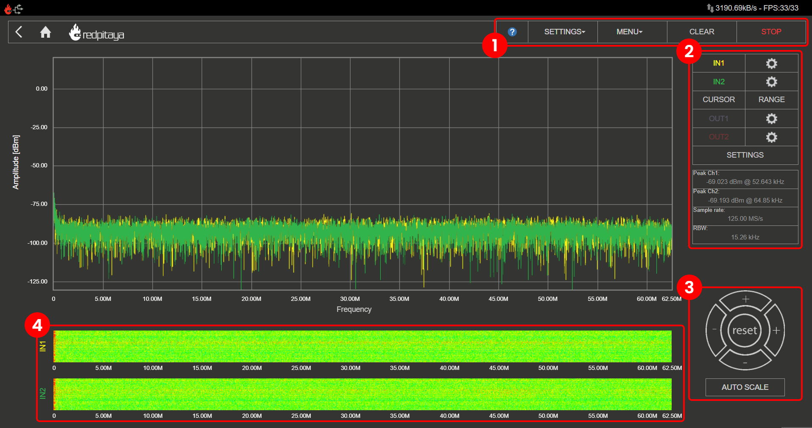
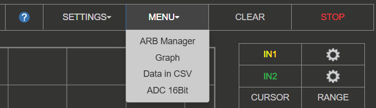
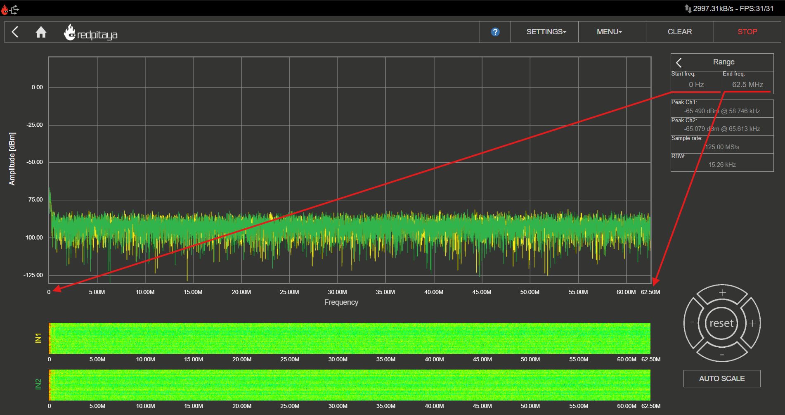
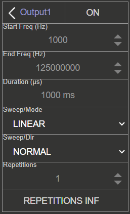

.. _spec_anal_app:

Spectrum Analyzer
#################

.. figure:: img/01_iPad_Combo_Spectrum.jpg
	:width: 1600

This application will turn your Red Pitaya board into a 2-channel DFT Spectrum Analyzer. It is the perfect tool for educators, students, makers, hobbyists, and professionals 
seeking affordable, highly functional test and measurement equipment. The DFT Spectrum Analyzer application enables a quick and powerful spectrum analysis using a DFT algorithm.

The frequency span is from DC up to 62.5 MHz, where the frequency range can be arbitrarily selected. You can easily measure the quality of your signals, signal harmonics, 
spuriousness, and power. All Red Pitaya applications are web-based and do not require the installation of any native software. Users can access them via a web browser using 
their smartphone, tablet, or a PC running any popular operating system (MAC, Linux, Windows, Android, and iOS). The elements of the DFT Spectrum analyzer application are 
arranged logically and offer a familiar user interface.

Apart from the graph, the user interface consists of four areas:

    1.  **Top settings menu** - Includes basic functionality like Settings, Exporting data, Clearing the display, and Running/Stopping the measurements.
    #.  **Channel settings and measurements** - This menu provides controls for inputs, cursors, and frequency range settings.
    #.  **Axis Control Panel** - By pressing the horizontal ± buttons, the time axis (X axis) scale is changed. The vertical ± buttons change the amplitude axis (Y axis) and thus 
	    the displayed amplitude range of the signal.
    #.  **Waterfall plots** - Waterfall plots are a different way of representing the signal spectrum where the colour of the plot defines the signal amplitude for a certain frequency. 
	    The waterfall plot is also useful to enable the representation of a signal spectrum in a time-dependent fashion.

|

Features
**********

.. contents:: Table of contents
    :local:
    :backlinks: top

|

1. Top settings menu
=====================

Provides control over the Spectrum Analyzer application. The blue question mark leads to this exact documentation page.

Settings
----------

The settings menu provides control over the application settings:

* **Save** - Saves the current Spectrum Analyzer settings under the specified name. The settings are saved in the SD card's local storage (board model specific).
* **Reset** - Resets all Spectrum Analyzer settings to default versions.
* **Recall** (user-specified name) - Recalls the previously saved Spectrum Analyzer settings. Each saved setting is listed in the drop-down menu, and the user can select the desired one.

Menu
-----

Includes the following settings:

* **ARB Manager** - Goes directly to the :ref:`Arbitrary Waveform Manager application <arb_manager_app>`, where a custom waveform can be uploaded for generation.
* **ADC 16 bit** - When checked, the spectrum analyzer will display the data in 16-bit resolution, provided that the decimation factor is sufficiently high (available on boards with non-16-bit native resolution).

.. - **Ext. Clock** (only SIGNALlab 250-12) - Enables the External Clock synchronisation for the SIGNALlab. For more info see the chapter below.

.. External reference clock (only SIGNALlab 250-12)
.. -------------------------------------------------

.. The external reference clock input can be enabled through the settings menu. Once enabled, its status is displayed in the main interface. The "green" status indicates that the sampling clock is locked to the external reference clock.
.. 
.. .. figure:: img/osc_top_menu_ext_clk.png
..     :width: 500

Clear
------

Clears the spectrum plot and resets the min/max values of the signal spectrum.

Run/Stop
-----------

Starts/Stops the data acquisition/Spectrum Analyzer. When stopped, the main graph is frozen.

|

2. Inputs
==========

On the right side of the Spectrum Analyzer application interface, the IN1 and IN2 channels are listed. With a simple click on the name of a channel (not the gear), the channel gets highlighted, and you can simply 
control all the settings of the respective channel. The available settings by device model:

.. tabs::

    .. group-tab:: STEMlab 125-14, 125-10, 4-Input

        .. figure:: img/spectrum_inputs_standard.png
            :height: 400

        * **Show** - Shows or hides the curve associated with the channel.
        * **Freeze** - Freezes the curve associated with the channel.
        * **Min** - Enables or disables the persist mode for the spectrum plot. The MIN signal spectrum plot will show the lowest values of the signal spectrum taken after enabling the "MIN" button.
        * **Max** - Enables or disables the persist mode for the spectrum plot. The MAX signal spectrum plot will show the highest values of the signal spectrum taken after enabling the "MAX" button.
        * **Probe attenuation** - (must be selected manually) The division of the probe.
        * **Input attenuation (LV and HV)** - Input attenuation of the board. Must be selected according to the :ref:`jumper position <anain>` on each channel.
        * **Filter (On/Off)** - Enables or disables the frequency equalisation filter on the input channel. The filter is disabled on Gen 2 boards.
        * **Reset minmax** - Resets the min/max values of the signal spectrum for the selected channel.

    .. group-tab:: SDRlab 122-16

        .. figure:: img/spectrum_inputs_sdrlab.png
            :height: 400

        * **Show** - Shows or hides the curve associated with the channel.
        * **Freeze** - Freezes the curve associated with the channel.
        * **Min** - Enables or disables the persist mode for the spectrum plot. The MIN signal spectrum plot will show the lowest values of the signal spectrum taken after enabling the "MIN" button.
        * **Max** - Enables or disables the persist mode for the spectrum plot. The MAX signal spectrum plot will show the highest values of the signal spectrum taken after enabling the "MAX" button.
        * **Probe attenuation** - (must be selected manually) The division of the probe.
        * **Reset minmax** - Resets the min/max values of the signal spectrum for the selected channel.

    .. group-tab:: SIGNALlab 250-12

        .. figure:: img/spectrum_inputs_signallab.png
            :height: 400

        * **Show** - Shows or hides the curve associated with the channel.
        * **Freeze** - Freezes the curve associated with the channel.
        * **Min** - Enables or disables the persist mode for the spectrum plot. The MIN signal spectrum plot will show the lowest values of the signal spectrum taken after enabling the "MIN" button.
        * **Max** - Enables or disables the persist mode for the spectrum plot. The MAX signal spectrum plot will show the highest values of the signal spectrum taken after enabling the "MAX" button.
        * **Probe attenuation** - (must be selected manually) The division of the probe.
        * **Input attenuation (LV and HV)** - 1:1 (± 1V) / 1:20 (± 20V) is selected automatically when adjusting the dBm/div setting; the user can also select the range manually through the web interface.
        * **Input coupling (DC/AC)** - Select input coupling.
        * **Filter (On/Off)** - Enables or disables the frequency equalisation filter on the input channel. The filter is disabled on Gen 2 boards.
        * **Reset minmax** - Resets the min/max values of the signal spectrum for the selected channel.

|

3. Cursors
============

The cursors are an additional vertical and horizontal pair of lines useful for extracting the values of the spectrum plots.

The cursors are interactive, and they can be set on any part of the graph while the frequency value is shown corresponding to the place where the 
X cursors are set and the amplitude value where the Y cursors are set. Cursor delta values are useful for measuring signal harmonics and relative 
ratios between amplitudes and frequencies.

.. figure:: img/spectrum_cursors.png
	:width: 1000

|

4. Range
=========

The range settings are used to set a frequency span. This feature is useful when the frequency range of interest is 
smaller than the full frequency range of the Spectrum analyzer application.

|

5. Outputs
============

On the right side of the Oscilloscope & Sig. Generator application interface, the OUT1 and OUT2 channels are listed. With a simple click on the name of a channel (not the gear), the channel gets highlighted, and you can simply 
control all the settings of the respective channel. The available settings are the following: 

.. tabs::

    .. group-tab:: STEMlab 125-14, 125-10, 4-Input

        .. figure:: img/spectrum_outputs_standard.png
            :height: 500

        * **ON** - Turns the generator output ON/OFF.
        * **Waveform Type** - Sine, Square (rectangle), Triangle, Sawu (rising sawtooth), Sawd (falling sawtooth), DC, DC_NEG, PWM (Pulse Width Modulation), and NOISE (white noise). Custom waveforms supplied through the :ref:`ARB Manager application <arb_manager_app>` also appear here.
        * **Sweep mode** - Configure the Sweep mode settings (See below).
        * **Frequency** - Frequency of the output signal (1 Hz - 50 MHz).
        * **Amplitude** - One-way amplitude of the output signal (referenced to GND).
        * **Offset** - DC offset.
        * **Phase** - Phase of the output signal.
        * **Duty cycle** - PWM signal duty cycle.
        * **Rise/Fall time** - Minimal rise and fall time for the output signal.
        * **Load** - Output load (50 Ohm or High-Z).

    .. group-tab:: SDRlab 122-16

        .. figure:: img/spectrum_outputs_sdrlab.png
            :height: 500

        * **ON** - Turns the generator output ON/OFF.
        * **Waveform Type** - Sine only (due to AC coupling). Custom waveforms supplied through the :ref:`ARB Manager application <arb_manager_app>` also appear here.
        * **Sweep mode** - Configure the Sweep mode settings (See below).
        * **Frequency** - Frequency of the output signal (300 kHz - 50 MHz).
        * **Amplitude** - One-way amplitude of the output signal (referenced to GND).
        * **Phase** - Phase of the output signal.

    .. group-tab:: SIGNALlab 250-12

        .. figure:: img/spectrum_outputs_signallab.png
            :height: 500

        * **ON** - Turns the generator output ON/OFF.
        * **Waveform Type** - Sine, Square (rectangle), Triangle, Sawu (rising sawtooth), Sawd (falling sawtooth), DC, DC_NEG, PWM (Pulse Width Modulation), and NOISE (white noise). Custom waveforms supplied through the :ref:`ARB Manager application <arb_manager_app>` also appear here.
        * **Sweep mode** - Configure the Sweep mode settings (See below).
        * **Frequency** - Frequency of the output signal (1 Hz - 50 MHz).
        * **Amplitude** - One-way amplitude of the output signal (referenced to GND).
        * **Output gain** -  Displays the status of the output gain stage (x1 or x5). The output gain stage is automatically set when adjusting the amplitude.
        * **Offset** - DC offset.
        * **Phase** - Phase of the output signal.
        * **Duty cycle** - PWM signal duty cycle.
        * **Rise/Fall time** - Minimal rise and fall time for the output signal.
        * **Load** - Output load (50 Ohm or High-Z).

.. note::

    STEMlab 125-14 4-Input does not have any outputs.

Sweep Mode
-----------

Configure the output to operate in sweep mode. All other settings, except frequency are kept from the Continuous mode (the higher menu). The sweep mode will 
stay active until turned OFF or the settings are RESET to defaults. Turning OFF the channel will not turn OFF the sweep mode, but it will stop generating 
the sweep signal. The status of sweep mode is displayed by the corresponding light in the output channel settings.

* **Start Freq (Hz)** - Sweep start frequency in Hertz.
* **End Freq (Hz)** - Sweep end/stop frequency in Hertz.
* **Duration (μs)** - Sweep duration in microseconds. When operating in UP-DOWN direction, this is applies to both directions (if set to 1000 ms, the sweep 
  will take 1000 ms in the UP direction and then 1000 ms in the DOWN direction).
* **Sweep Mode** - Either LINEAR or LOG.
* **Sweep Dir** - Sweep direction. Either NORMAL or UP-DOWN.
* **Repetitions (NOR)** - Number of repeated sweeps. Also known as Number Of Repetitions (NOR).
* **REPETITIONS INF** - When selected, the sweep signals are repeated indefinitely.

|

6. Settings
=============

.. tabs::

    .. group-tab:: STEMlab 125-14, 125-10, 4-Input

        .. figure:: img/spectrum_settings_standard.png
            :height: 500

        * **Type** - Selects the unit of the amplitude axis (Y-axis) for the signal spectrum. The available units are dBm, dBµ, dBV, dBµV, V, mW, and dBW.
        * **Impedance (Ω)** - Specify the input impedance of the device under test (DUT). The available options are 50 Ω and 75 Ω. This value is used to calculate the amplitude of the signal spectrum in dBm, dBµ, mW, and dBW units.
        * **X-axis** - Selects the scaling of the frequency axis (X-axis). The available options are linear and logarithmic (normal, p2, and p10) scaling.
        * **Window** - Selects the windowing function for the DFT algorithm. The available options are Rectangular, Hanning, Hamming, Blackman-Harris, Flat Top, Kaiser (β = 4), and Kaiser (β = 8).
        * **Buffer size** - Selects the number of samples used for the DFT algorithm. The available options are 16384, 8192, 4096, 2048, 1024, 512, and 256 samples.
        * **Remove DC** - Enables or disables the removal of the DC component from the signal spectrum. When enabled, the DC component is removed from the signal spectrum, which can be useful for analyzing AC signals.

    .. group-tab:: SDRlab 122-16

        .. figure:: img/spectrum_settings_standard.png
            :height: 500

        * **Type** - Selects the unit of the amplitude axis (Y-axis) for the signal spectrum. The available units are dBm, dBµ, dBV, dBµV, V, mW, and dBW.
        * **Impedance (Ω)** - Specify the input impedance of the device under test (DUT). The available options are 50 Ω and 75 Ω. This value is used to calculate the amplitude of the signal spectrum in dBm, dBµ, mW, and dBW units.
        * **X-axis** - Selects the scaling of the frequency axis (X-axis). The available options are linear and logarithmic (normal, p2, and p10) scaling.
        * **Window** - Selects the windowing function for the DFT algorithm. The available options are Rectangular, Hanning, Hamming, Blackman-Harris, Flat Top, Kaiser (β = 4), and Kaiser (β = 8).
        * **Buffer size** - Selects the number of samples used for the DFT algorithm. The available options are 16384, 8192, 4096, 2048, 1024, 512, and 256 samples.
        * **Remove DC** - Enables or disables the removal of the DC component from the signal spectrum. When enabled, the DC component is removed from the signal spectrum, which can be useful for analyzing AC signals.

    .. group-tab:: SIGNALlab 250-12

        .. figure:: img/spectrum_settings_signallab.png
            :height: 500

        * **Type** - Selects the unit of the amplitude axis (Y-axis) for the signal spectrum. The available units are dBm, dBµ, dBV, dBµV, V, mW, and dBW.
        * **Impedance (Ω)** - Specify the input impedance of the device under test (DUT). The available options are 50 Ω and 75 Ω. This value is used to calculate the amplitude of the signal spectrum in dBm, dBµ, mW, and dBW units.
        * **X-axis** - Selects the scaling of the frequency axis (X-axis). The available options are linear and logarithmic (normal, p2, and p10) scaling.
        * **Window** - Selects the windowing function for the DFT algorithm. The available options are Rectangular, Hanning, Hamming, Blackman-Harris, Flat Top, Kaiser (β = 4), and Kaiser (β = 8).
        * **Buffer size** - Selects the number of samples used for the DFT algorithm. The available options are 16384, 8192, 4096, 2048, 1024, 512, and 256 samples.
        * **Remove DC** - Enables or disables the removal of the DC component from the signal spectrum. When enabled, the DC component is removed from the signal spectrum, which can be useful for analyzing AC signals.
        * **Ext. Clock** - Enables the External Clock synchronisation for the SIGNALlab. For more info see the chapter below.

Window function and buffer size considerations
-----------------------------------------------

The reported peak amplitude depends on the selected window function and, to a lesser extent, on the chosen buffer size. When comparing measurements taken with different windows, differences of approximately 0.5 dB to 2.5 dB are expected.

Buffer size also affects the resolution bandwidth (RBW). A larger buffer size provides a narrower RBW, which improves separation of closely spaced signals and can lower the displayed noise floor. The trade-off is a 
longer acquisition/processing time per measurement update.

External reference clock (SIGNALlab 250-12 only):
---------------------------------------------------

The external reference clock input can be enabled through the settings menu. Once enabled, its status is displayed in the main interface. The "green" status 
indicates that the sampling clock is locked to the external reference clock.

|

7. Measurements
====================

.. figure:: img/spectrum_measurements.png
	:height: 400

Spectrum analyzer application automatically measures the following parameters of the signal spectrum:

* **Peak frequency** - The frequency of the peak value of the signal spectrum.
* **Sampling rate** - The sampling rate of the signal spectrum (depends on the frequency range).
* **RBW** - The resolution bandwidth of the signal spectrum (depends on the frequency range).

Peak detection
----------------

During the measurement, peak values of the signal spectrum are measured and shown in the "Peak Values" field. Peak values are the max values of the signal spectrum 
regardless of the selected frequency range. This peak finding prevents not seeing peak values that are outside the selected frequency span.

Sampling rate and RBW
-----------------------

The sampling rate and RBW are automatically calculated based on the selected frequency range. The sampling rate is the rate at which the 
signal spectrum is sampled, and the RBW is the bandwidth of the filter used to measure the signal spectrum. The RBW is inversely proportional 
to the sampling rate, meaning that a higher sampling rate results in a lower RBW and vice versa.

|

8. Axis control and navigation
===============================

Axis control and navigation are used to change the frequency and amplitude range of the signal spectrum. The horizontal ± buttons 
are used to select the span of the X (frequency) axis (zooming in/out). The vertical ± buttons change the Y (amplitude)-axis range. 
When the Reset button is pressed, the frequency and amplitude span are reset to their default values.

Zooming
--------

The zooming feature allows the user to zoom in on the signal spectrum plot. Click and drag the mouse over the area of interest on the plot to zoom in. 
To zoom out, click the Reset button, which will reset the frequency and amplitude span to their default values.

Autoscale
-----------

The autoscale feature automatically adjusts the frequency and amplitude span of the signal spectrum plot to fit the data. When enabled, the autoscale feature 
will adjust the plot to show the entire signal spectrum, regardless of the selected frequency range.

|

9. Waterfall plots
====================

Waterfall plots are a different way of representing the signal spectrum where the colour on the plot defines the signal amplitude for a certain frequency. 
The waterfall plot is also useful when enabling the representation of the signal spectrum in a time dependency.

|

Specifications
***************

+-------------------------------+-------------------------------------+----------------------------+-------------------------+-------------------------+-------------------------+-------------------------+
|                               | **STEMlab 125-14** [#f1]_ |br|      | **STEMlab 125-14 4-Input** | **STEMlab 65-16 TI**    | **SDRlab 122-16**       | **SIGNALlab 250-12**    | **STEMlab 125-10**      |
|                               | **STEMlab 125-14 Gen 2** [#f1]_ |br||                            |                         |                         |                         |                         |
|                               | **STEMlab 125-14 TI**               |                            |                         |                         |                         |                         |
|                               |                                     |                            |                         |                         |                         |                         |
+===============================+=====================================+============================+=========================+=========================+=========================+=========================+
| Input channels                | 2                                   | 4                          | 2                       | 2                       | 2                       | 2                       |
+-------------------------------+-------------------------------------+----------------------------+-------------------------+-------------------------+-------------------------+-------------------------+
| Bandwidth                     | 0 - 60 MHz                          | 0 - 60 MHz                 | 0 - 30 MHz              | 0 - 60 MHz              | 0 - 60 MHz              | 0 - 50 MHz              |
+-------------------------------+-------------------------------------+----------------------------+-------------------------+-------------------------+-------------------------+-------------------------+
| Resolution                    | 14 bit                              | 14 bit                     | 16 bit                  | 16 bit                  | 12 bit                  | 10 bit                  |
+-------------------------------+-------------------------------------+----------------------------+-------------------------+-------------------------+-------------------------+-------------------------+
| DFT buffer                    | 16384                               | 16384                      | 16384                   | 16384                   | 16384                   | 16384                   |
+-------------------------------+-------------------------------------+----------------------------+-------------------------+-------------------------+-------------------------+-------------------------+
| Dynamic Range                 | 80 dB                               | 80 dB                      | 96 dB                   | 96 dB                   | 74 dB                   | 60 dB                   |
+-------------------------------+-------------------------------------+----------------------------+-------------------------+-------------------------+-------------------------+-------------------------+
| Input noise level             | < -119 dBm/Hz                       | < -119 dBm/Hz              |                         |                         |                         | < -100 dBm/Hz           |
+-------------------------------+-------------------------------------+----------------------------+-------------------------+-------------------------+-------------------------+-------------------------+
| Input range                   | 10 dBm                              | 10 dBm                     | 10 dBm                  | -2 dBm                  | 10 dBm (LV mode)        | 10 dBm                  |
+-------------------------------+-------------------------------------+----------------------------+-------------------------+-------------------------+-------------------------+-------------------------+
| Input impedance               | 1 MΩ / 10 pF                        | 1 MΩ / 10 pF               | 1 MΩ / 10 pF            | 50 Ω                    | 1 MΩ / 10 pF            | 1 MΩ / 10 pF            |
+-------------------------------+-------------------------------------+----------------------------+-------------------------+-------------------------+-------------------------+-------------------------+
| Input coupling                | DC                                  | DC                         | DC                      | AC                      | AC/DC                   | DC                      |
+-------------------------------+-------------------------------------+----------------------------+-------------------------+-------------------------+-------------------------+-------------------------+
| Spurious frequency components | < -90 dBFS Typically                | < -90 dBFS Typically       |                         |                         |                         | < -70 dBFS Typically    |
+-------------------------------+-------------------------------------+----------------------------+-------------------------+-------------------------+-------------------------+-------------------------+

.. ! Revise the measurements

.. [#f1] This includes STEMlab 125-14 and its variations (external clock, LN, etc.). The same is true for STEMlab 125-14 Gen 2 boards (PRO, PRO Z7020, etc.)

|

Source code
*************

The :rp-github:`Spectrum analyzer source code <RedPitaya/tree/master/apps-tools/spectrumpro>` is available on our GitHub.
