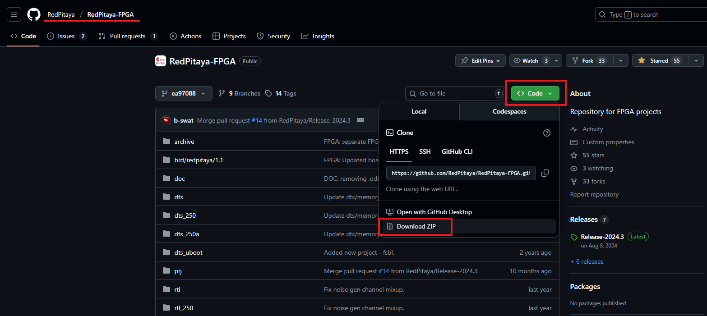

.. _fpga_create_project:

##############################################
Creating an FPGA project in Vivado (2025.1)
##############################################

To ease the creation of new FPGA projects or adding new features to existing ones, Red Pitaya FPGA repository provides scripts and templates that automatically generate the :ref:`existing projects <fpga_projects>`.

.. note::

    This section describes the current build flow for **Vivado 2025.1** (OS 3.00+), based on the scripts in the RedPitaya-FPGA repository.
    The legacy Vivado 2020.1 method is still available for backward compatibility and is summarized in the `Legacy Vivado 2020.1 compatibility`_ section.

.. contents:: Table of Contents
    :local:
    :depth: 2
    :backlinks: top

|

Download FPGA GitHub repository
================================

First, we will transfer the |FPGA GitHub repository| to our local machine. Go to the |FPGA GitHub repository| and download the ZIP folder of this project.

If you are using Windows, download and extract the project repository to a folder of your choice. Remember the location of the extracted repository.

As an alternative, if you are using Linux, first install Git, then navigate to the desired location and clone the Red Pitaya Git repository.

.. code-block:: bash

    sudo apt-get install git
    git clone https://github.com/RedPitaya/RedPitaya-FPGA.git

In either case, **refrain from using spaces in the path** to the extracted repository or the cloned repository.

Finally, rename the extracted repository folder to **RedPitaya-FPGA**.

Accessing older versions of the repository
-------------------------------------------

The instructions above are meant for the latest version of the Red Pitaya FPGA, located in the *master* branch. If you are looking for an older version, please check the corresponding branch or tag in the GitHub repository.

Before OS 1.04-18, the FPGA repository was a part of the main |Red Pitaya GitHub repository|, and the FPGA projects were located in the *fpga* directory.

|

.. _FPGA_project_flags:

Build project options
=======================

When creating a new FPGA project, each user must consider the specific requirements and constraints of their target hardware platform. Each Red Pitaya board has its own specifications, which may require different configurations and optimizations in the FPGA design.
To make things easier, the Red Pitaya FPGA repository provides a set of scripts and templates that can be used as a starting point for new projects. These templates include pre-configured settings and example designs that can be customized to meet the needs of individual projects.

The scripts automatically build the project depending on the selected flags. The following table shows which projects are available on which boards.

.. include:: ../projects/fpga_project_table.inc

.. include:: ../projects/fpga_project_flags.inc

.. note::

    Each combination of build project and build model flags should be considered unique and compatible exclusively with the corresponding Red Pitaya board model. This means that a bitstream generated for one board may not work on another board, even if they share the same FPGA chip.
    For example, a bitstream generated for *STEMlab 125-14* will not work on *SDRlab 122-16*, resulting in the following error upon upload.
    
    .. code-block:: bash

        sh: 1: echo: echo: I/O error
        BIN FILE loading through FPGA manager failed

|

Building process
=================

.. note::

    Before proceeding, please check that the :ref:`Vivado and Vitis installation instructions <FPGA_install_vivado>` were followed correctly.

    For the current RedPitaya-FPGA flow, the main entry points are:

    * ``open_vivado.sh`` (Linux/Unix-like shells)
    * ``open_vivado.bat`` (native Windows CMD/PowerShell)
    * Root ``Makefile`` targets (``make project``, ``make``, ``make dts``)

The automatic project generation scripts have two possible modes of operation:

* **Non-project mode**: This mode generates a set of files that can be used to build the project without opening the Vivado GUI. It is useful for users who prefer to work with command-line tools or want to automate the build process.
* **Project mode**: This mode generates a Vivado project that can be opened in the Vivado GUI for further editing and customization. It is useful for users who want to work with the graphical interface of Vivado and make changes to the design interactively.

|

Non-project mode
-----------------

In non-project mode, the generated files are organized in a flat directory structure, making it easier to manage and version control the individual files. However, users lose the benefits of the Vivado project structure, such as the ability to easily open and edit the project in the Vivado GUI.
Non-project mode uses RTL, constraints, and board configuration files to generate outputs without creating a full GUI project.

.. note::

    The Red Pitaya FPGA repository must be downloaded through the ``git`` command, otherwise the project creation will fail.

The current repository contains these relevant script types:

+-----------------------------------+---------------------------------------------------------------------------+
| TCL script                        | Functionality                                                             |
+===================================+===========================================================================+
| ``red_pitaya_vivado_<MODEL>.tcl`` | Generates the bitstream and reports for a selected model.                 |
+-----------------------------------+---------------------------------------------------------------------------+
| ``red_pitaya_hsi_fsbl.tcl``       | Generates FSBL executable binary (see |SDK/Vitis project creation|).      |
+-----------------------------------+---------------------------------------------------------------------------+
| ``red_pitaya_hsi_dts.tcl``        | Generates device tree sources (see |SDK/Vitis project creation|).         |
+-----------------------------------+---------------------------------------------------------------------------+
| ``red_pitaya_vivado_sim.tcl``     | Generates simulation files.                                               |
+-----------------------------------+---------------------------------------------------------------------------+

1. **Open terminal or shell**.

    * **Linux**: use a regular terminal.
    * **Windows native GUI flow**: use CMD/PowerShell with ``open_vivado.bat``.
    * **Windows make-based flow**: use a Unix-like shell (*Git Bash*, *MSYS2*, or *WSL*), as the Makefile uses Unix shell tools.

    .. note::

        For ``make``-based builds on Windows, install and expose these tools in your shell environment: ``make``, ``gcc``, ``dtc``, and ``xsct``.

#. **Navigate to the extracted FPGA repository**. In this instance, we have renamed the extracted folder to RedPitaya-FPGA. If you have not renamed the folder, please use the original name.

    .. code-block:: bash

        cd "<path to Red Pitaya repository>/RedPitaya-FPGA"

    .. note::

        Contrary to Linux and Vivado, Windows uses backslashes (``\``) instead of forward slashes (``/``) in file paths.

#. **Generate the project**. Run the following command in the terminal or command prompt. Note the **lack of the ``project`` keyword**, which is used in the `Project mode`_.

    .. code-block:: bash

        make PRJ=name MODEL=model

    This is the standard non-project build command for RedPitaya-FPGA.
    You can also generate only the device tree with:

    .. code-block:: bash

        make dts PRJ=name MODEL=model

#. **Bitstream location**. The resulting bitstream *.bit* file is located in **/prj/<project_name>/out/red_pitaya.bit**.

.. note::

    If an error occurs during the project generation, it is likely due to an incorrect Vivado version or missing dependencies. Please ensure that you have the correct version of Vivado installed and that all necessary dependencies are met.
    For more information on this issue, please refer to the `Running the scripts in a different Vivado version`_ section.

|

Project mode
-------------

The project mode generates a complete Vivado project structure, including all necessary files and directories. This allows users to open the project in the Vivado GUI and make changes as needed.
Only the Red Pitaya FPGA repository is required to create a project in this mode. The project can be created using the following steps:

1.  **Open terminal or shell**.

    * **Linux/Unix-like shell**:

      .. code-block:: bash

          ./open_vivado.sh <project_name> <model>

      Example:

      .. code-block:: bash

          ./open_vivado.sh v0.94 Z20_250

    * **Windows CMD/PowerShell (native)**:

      .. code-block:: bat

          open_vivado.bat <project_name> <model>

      Example:

      .. code-block:: bat

          open_vivado.bat v0.94 Z20_250

    * **Alternative (Linux or Unix-like shell on Windows):**

      .. code-block:: bash

          make project PRJ=<project_name> MODEL=<model>

#.  **Navigate to the extracted FPGA repository**. In this instance, we have renamed the extracted folder to RedPitaya-FPGA. If you have not renamed the folder, please use the original name.

    .. code-block:: bash

        cd "<path to Red Pitaya repository>/RedPitaya-FPGA"

    .. note::

        Contrary to Linux and Vivado, Windows uses backslashes (``\``) instead of forward slashes (``/``) in file paths.

#.  **Create or open the project**. Use one of the commands above for your OS/shell.

    Here are reference pictures for the command-line options:

    * **Terminal/CMD**

        .. figure:: img/Vivado-CMD.png
            :width: 800
            :align: center

    * **Vivado HLS Command Prompt**

        .. figure:: img/Vivado-hls-command-prompt.png
            :width: 800
            :align: center

    * **Vivado TCL Console**

        .. figure:: img/Vivado-tcl-console.png
            :width: 800
            :align: center

#.  **Modify the project**. A project will be opened with all required Red Pitaya files.
    You can then add or write your Verilog module at the end of the *red_pitaya_top.sv* file, or add a new source by right-clicking the *Design Sources* folder and selecting *Add Source*.
    For more information on how to add sources and connect them in the design, please refer to the :ref:`Modify project section <fpga_modify_project>`.

#.  **Bitstream generation**. You can now run the synthesis, implementation, and bitstream generation by clicking the corresponding buttons in the Vivado GUI.
    The resulting *.bit* file is located in **prj/<project_name>/project/redpitaya.runs/impl_1/** as **red_pitaya_top.bit** (the name of the bitstream file matches the name of the top module of the design).

    .. figure:: img/Vivado-GUI.png
       :width: 600
       :align: center

|

There are a few important things to note about the project creation process:

4.  **Reopen an existing project** - Open Vivado and select the project from the **Recent Projects** list.

    .. figure:: img/Vivado-recent-projects.png
        :width: 800
        :align: center

#.  **Recreating an existing project** - Rerunning the *make project* command for the same ``PRJ`` can overwrite generated project resources. Please back up important RTL resources and IP cores.

|

.. _fpga_copy_project:

Creating a Safe Project Copy (Recommended)
===========================================

.. note::

    The information in this section is relevant for **automatic project generation**. For manual project creation, the process is much simpler and 
    only requires copying the baseline project and modifying the RTL and constraints as needed. For more information, see :ref:`Creating a Custom Project from Scratch <fpga_project_from_scratch>`.

If you are building a custom variant, do not continue editing directly in ``prj/v0.94`` (or another shared baseline project directory).
Create a project copy first.

Why this matters:

- rebuilding the same ``PRJ`` can overwrite generated data
- keeping a separate ``prj/<new_project>`` folder makes backup and versioning easier

What does **not** need renaming:

- the root launcher/model scripts such as ``red_pitaya_vivado_Z10.tcl`` or ``red_pitaya_vivado_Z20.tcl``
- ``open_vivado.sh`` / ``open_vivado.bat``
- the project-local filename ``ip/system.tcl``

These scripts are selected by ``MODEL`` and then use the folder name passed as ``PRJ`` to enter ``prj/<new_project>``.

Recommended steps:

1. Create a new project folder under ``prj/``.
2. Copy a baseline project (for example ``prj/v0.94``) into your new folder.
3. Put your custom RTL in ``prj/<new_project>/rtl``.
4. Keep testbenches in ``prj/<new_project>/tbn``.
5. Build with explicit model flags.

Example:

.. code-block:: bash

    cd RedPitaya-FPGA
    cp -r prj/v0.94 prj/new_project
    make project PRJ=new_project MODEL=Z10
    make PRJ=new_project MODEL=Z10

Windows native project-open example:

.. code-block:: bat

    open_vivado.bat new_project Z10

Additional checks after copying
--------------------------------

Copying a project directory is usually enough for baseline projects such as ``v0.94``.
However, it is **not always sufficient** for every project.

Repository check against current ``RedPitaya-FPGA`` master shows that some root model scripts contain project-name-specific logic, for example:

- ``if {$prj_name == "stream_app"}``
- ``if {$prj_name == "logic"}``

These branches set project-specific global variables before sourcing the local block-design Tcl.

This means:

- copying ``v0.94`` to a new name is generally straightforward
- copying ``stream_app`` or ``logic`` to a new name may require additional script updates

Typical follow-up tasks for renamed project copies:

1. Check whether the copied project depends on ``$prj_name`` matches in ``red_pitaya_vivado_<MODEL>.tcl``.
2. If it does, update those conditions for your new project name or refactor the project-specific settings into project-local Tcl.
3. Review local helper scripts under ``tbn/`` and similar folders for hardcoded project paths or old names.

.. note::

    In the current repository, the main build entry points use the copied folder name correctly. The extra work appears only when a project relies on exact project-name checks or contains helper scripts with hardcoded paths.

For manual file-selection details (constraints and config files) when creating projects beyond template copying, see :ref:`fpga_project_from_scratch`.

|

.. _fpga_legacy_2020_flow:

Legacy Vivado 2020.1 compatibility
====================================

The current RedPitaya-FPGA ``master`` branch targets **Vivado 2025.1**. For older OS branches or archived projects that were created for Vivado 2020.1, keep using the legacy flow.

* **Current branch (OS 3.00+):** Vivado 2025.1
* **Legacy flow (OS 1.04 - 2.00):** Vivado 2020.1 + SDK 2019.1

For legacy tool installation and usage, see :ref:`Vivado 2020.1 installation <FPGA_install_vivado_2020_1>` and :ref:`SDK 2019.1 legacy installation <fpga_install_sdk>`.

Legacy flow steps (verified against repository tags)
-----------------------------------------------------

Use a legacy RedPitaya-FPGA snapshot that was built for Vivado 2020.1 (for example tag ``2.07-48``).

1. **Clone repository and checkout a legacy tag**

    .. code-block:: bash

        git clone https://github.com/RedPitaya/RedPitaya-FPGA.git
        cd RedPitaya-FPGA
        git checkout 2.07-48

2. **Project mode (open GUI project) using legacy scripts**

    .. code-block:: bash

        make project PRJ=v0.94 MODEL=Z10

    This legacy flow uses ``red_pitaya_vivado_project_<MODEL>.tcl`` scripts.

3. **Non-project mode (build bitstream directly)**

    .. code-block:: bash

        make PRJ=v0.94 MODEL=Z10

4. **Optional: generate device tree only**

    .. code-block:: bash

        make dts PRJ=v0.94 MODEL=Z10

5. **Expected legacy outputs**

    * Bitstream: ``prj/v0.94/out/red_pitaya.bit``
    * Bitstream binary: ``prj/v0.94/out/red_pitaya.bit.bin``

Windows and Linux notes for legacy flow
----------------------------------------

* **Linux**: run commands in a regular shell with Vivado 2020.1 environment loaded.
* **Windows with Unix-like shell (Git Bash/MSYS2/WSL)**: ``make`` flow works as above.
* **Windows CMD/PowerShell without make**: run Vivado directly with legacy Tcl entry points:

  .. code-block:: bat

      C:\Xilinx\Vivado\2020.1\bin\vivado.bat -source red_pitaya_vivado_project_Z10.tcl -tclargs v0.94

  .. code-block:: bat

      C:\Xilinx\Vivado\2020.1\bin\vivado.bat -source red_pitaya_vivado_Z10.tcl -tclargs v0.94

| 

Running the scripts in a different Vivado version
==================================================

Running the auto-project generation scripts in a different Vivado version than the one they were generated for may result in errors. This is because the scripts are tailored to specific Vivado versions and may not be compatible with others.
If possible, please install the Vivado version that the scripts were generated for. If you cannot do this, you can try to modify the scripts to make them compatible with your Vivado version.
Please note that **this is not guaranteed to work and may require additional modifications to the scripts**.

* **Vivado version (current scripts):** 2025.1

Both `Project mode`_ and `Non-project mode`_ scripts are designed for a specific Vivado version and can fail when run in a different one.

.. code-block:: shell-session

    ... This script was generated using Vivado <2025.1> and is being run in <other_version> ...

1.  First, **find the Vivado version line** in the script. It should look like this:

    .. code-block:: shell-session

        set scripts_vivado_version 2025.1

#.  **Change the script version only if necessary**. This is a quick workaround to get a build moving in another Vivado version.
    However, this solution could cause problems if some of the IPs used are different in your version.

    To update the script properly, open the project in `Project mode`_ and select **Reports > Report IP Status** from the menu. A new tab will open below the code window.
    If not all IPs are up to date, they need to be updated. Before doing this, however, you must manually modify the TCL script to match your Vivado version; otherwise, the block design will not be created when Vivado starts.

    .. figure:: img/Vivado-IPupdate.png
        :width: 800
        :align: center

#.  **Update the script**. Once the IPs are up to date, go to the Tcl console tab and run the following command.

    .. code-block:: shell-session

        write_bd_tcl systemZ10.tcl

    This generates a new tcl script that replaces the old script in the ``prj/<project name>/ip`` directory.

    .. note::

        Depending on the board model you are using, the script name may differ. Please check the `Build project options`_ to identify the correct script name from the project flags.

.. Substitutions

.. |FPGA GitHub repository| replace:: `FPGA GitHub repository <https://github.com/RedPitaya/RedPitaya-FPGA>`__
.. |Red Pitaya GitHub repository| replace:: `Red Pitaya GitHub repository <https://github.com/RedPitaya/RedPitaya>`__
.. |SDK/Vitis project creation| replace:: :ref:`SDK/Vitis project creation <fpga_create_sdk_project>`