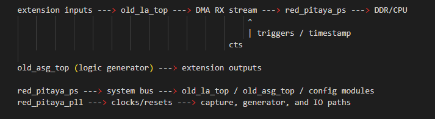

.. _fpga_project_logic:

#######################
FPGA logic project
#######################

The ``logic`` project is the FPGA image used for logic-analyzer focused workflows.
Its design emphasizes digital data capture and transfer, including DMA-based buffering to DDR.

.. contents:: Table of Contents
    :local:
    :depth: 1
    :backlinks: top

|

Purpose
----------

Use ``logic`` when your main goal is digital protocol observation and analysis rather than mixed analog instrumentation.

Typical use cases:

* capture digital buses for decode/analysis in software
* run logic-analyzer style acquisition with memory-backed buffers
* prototype digital trigger/capture chains

|

Architecture overview
----------------------

The project includes:

* model-specific top modules under ``rtl/``
* block-design integration via ``ip/system.tcl``
* DMA-related device-tree fragments under ``dts/``
* simulation assets under ``sim/`` and ``tbn/``

The device-tree fragment ``dts/dma.dtsi`` disables AXI DMA nodes by default and expects runtime overlay enablement where required by the software flow.

|

Project structure
------------------

In ``prj/logic/``:

* ``rtl/`` - top-level project RTL and PS wrappers
* ``ip/`` - Vivado block-design Tcl definition
* ``dts/`` - FPGA and DMA overlay fragments
* ``sdc/`` - constraints for supported models
* ``sim/`` and ``tbn/`` - simulation scripts and benches

|

Build and integration notes
----------------------------

Typical commands:

* ``make project PRJ=logic MODEL=Z20``
* ``make PRJ=logic MODEL=Z20``
* ``make dts PRJ=logic MODEL=Z20``

When integrating with software:

* check that the correct overlay/device-tree path is used for your model
* verify DMA channel enablement and capture path initialization
* validate expected sample depth and trigger behavior in your analysis toolchain

|

Code architecture (modules)
----------------------------

The main source is ``prj/logic/rtl/red_pitaya_top.sv``. The structure follows the same Red Pitaya integration pattern as other active projects, but with emphasis on logic-analyzer style digital capture.

Core integration modules:

* ``red_pitaya_ps`` - PS/DDR/MIO interface and AXI stream bridge to software.
* ``red_pitaya_pll`` - clock generation and reset distribution.
* ``sys_bus_interconnect`` - system-bus address split toward functional modules.
* ``sys_bus_stub`` - termination for unimplemented address slots.
* ``old_id`` - image identification registers.
* ``cts`` - timestamp counter for capture timing.
* ``muxctl`` - runtime path/loopback controls.

Logic-capture path modules:

* ``old_la_top`` - logic-analyzer acquisition from extension inputs, with trigger and DMA stream output.
* ``old_asg_top`` (instance ``lg``) - logic-generator output used for digital stimulus.
* ``axi4_stream_pas`` - stream pass-through/loopback utility path.

Support modules:

* ``sys_reg_array_o`` + ``pdm`` - register-driven PDM output support.
* optional ``sys_reg_array_o`` + ``pwm`` - only when compile-time enabled.

The ``prj/logic/dts/dma.dtsi`` fragment keeps DMA nodes disabled by default until enabled through the intended software/overlay flow.

|

Module connection schematic
----------------------------

